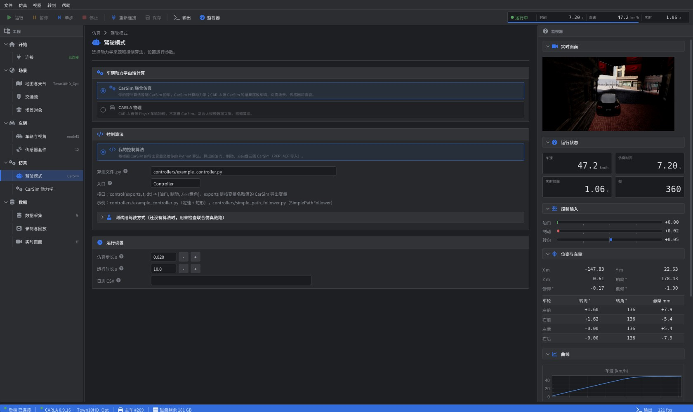
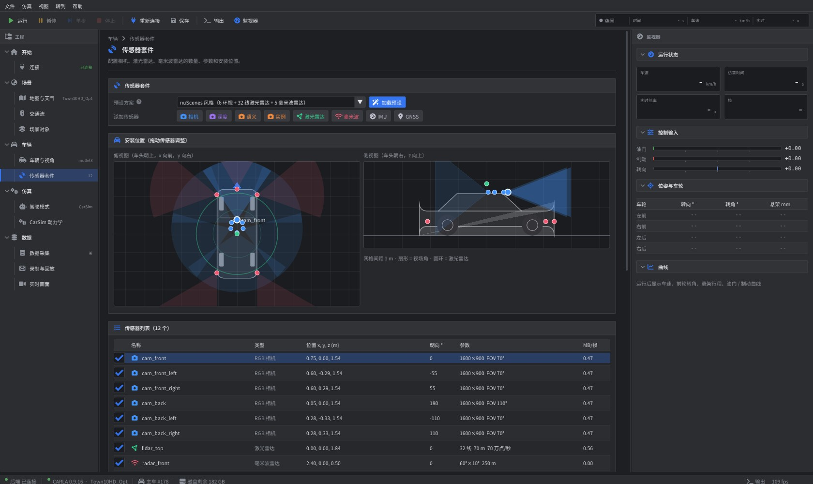
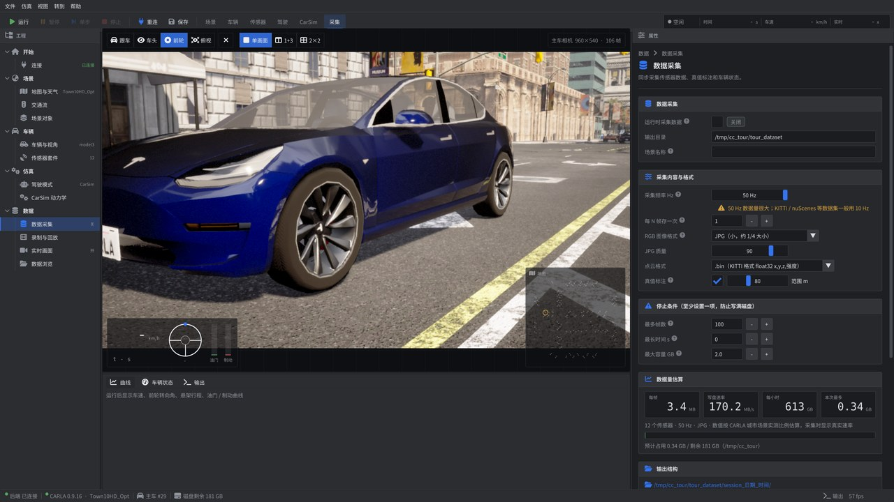
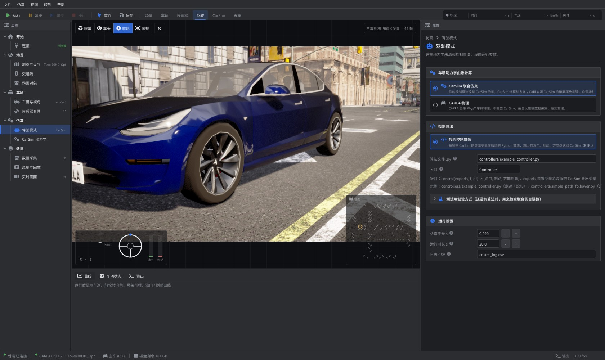
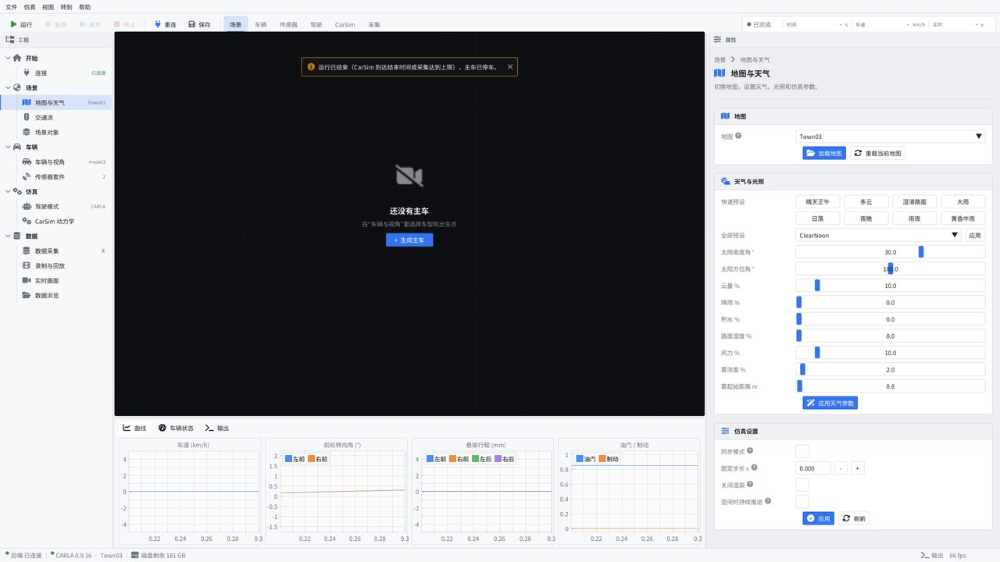

# CARLA CoSim Studio

**CarSim ⇄ CARLA 联合仿真平台** —— 像 CarSim 一样，全部通过图形界面操作 CARLA。

**你的控制算法控制 CarSim 里的车，CarSim 计算车辆动力学，CARLA 负责场景、渲染和传感器。** 每一帧 CarSim 算出的车身位姿、四轮转向角、车轮转速、悬架行程都同步到 CARLA 车辆上，CARLA 自己不算动力学，只照 CarSim 的结果摆放车辆，**转向机构一致**。再配上传感器套件编辑、数据采集、场景和交通等功能，不写代码也能完成仿真和数据集生产。

```
你的控制算法 (Python) ──油门 / 制动 / 方向盘──▶ CarSim（车辆动力学）
                                                    │ 位姿 · 车轮 · 悬架（每帧）
                                                    ▼
                          CARLA（场景 · 交通 · 相机 / 激光雷达 / 毫米波雷达 · 画面 · 数据采集）
```



## 📖 使用文档

| 文档 | 内容 |
|---|---|
| **[Ubuntu 使用指南](docs/Ubuntu使用指南.md)** | 从零安装、原版 / 改版 CARLA、Python 环境、编译界面、桌面一键启动、命令行、测试、常见问题 |
| **[Windows 使用指南](docs/Windows使用指南.md)** | 从零安装、CARLA、Python、界面、一键启动、**接入 CarSim**、改版 CARLA、常见问题 |
| **[界面操作手册](docs/界面操作手册.md)** | 每个页面、每个按钮的说明，数据采集输出格式，常用操作流程 |
| [CarSim 导出变量清单](carsim_carla_bridge/docs/CarSim导出变量清单.md) | CarSim 里要导出哪些变量、单位、坐标约定 |
| [Windows 编译指南](carsim_carla_bridge/docs/Windows编译指南.md) | 在 Windows 上编译改版 CARLA |

## 功能

| 模块 | 能做什么 |
|---|---|
| **CarSim 联合仿真** | CarSim 与 CARLA 同步步进；四轮实际转向角（阿克曼、转向柔度一比一）、车轮转速（可看出打滑 / 抱死）、悬架行程、车身侧倾俯仰全部同步；导出变量可视化编辑与校验 |
| **驾驶模式** | **CarSim 联合仿真**：你的 Python 控制算法（每次运行自动重新加载，改完代码直接再运行）控制 CarSim，CARLA 照 CarSim 结果同步；测试用演示 / 路线跟随 / 键盘驾驶。**CARLA 物理**（不需要 CarSim）：路线跟随、CARLA 自动驾驶（遵守红绿灯、跟车）、键盘驾驶 |
| **传感器套件** | 预设 单前视 / KITTI / nuScenes / 量产车 / 感知真值，按车型尺寸自动布置；俯视图 + 侧视图拖动安装，显示视场角；相机、深度、语义、实例、激光雷达、毫米波雷达、IMU、GNSS |
| **数据采集** | 所有传感器同一帧同步采样；图像 JPG/PNG、点云 .bin/.npy、雷达 CSV；自动生成标定文件（内参 K、外参）、3D 真值框、车辆状态；采集前估算数据量，没有停止条件或空间不足时拒绝开始 |
| **场景** | 地图切换、天气预设和 9 个参数、背景交通流（车辆 + 行人）、场景对象管理、录制与回放 |
| **视口与监视** | 仿真软件式布局：中间是实时 3D 画面（跟车 / 车头 / 前轮特写 / 俯视 / 任意套件相机），叠加车速、方向盘、踏板仪表和带轨迹的小地图；底部面板有实时曲线、车辆状态（位姿、四轮数据）、输出日志 |
| **运行控制** | 运行 / 暂停 / 单步 / 继续 / 停止（F5 / F6 / F10 / Shift+F5）；停止或到时结束后主车停车；运行因到时、出错结束时画面上方提示原因；运行时长默认 0 = 一直运行 |
| **界面** | 菜单栏 + 工具栏（按流程的页签）、左侧工程树、右侧属性面板、底部曲线 / 状态 / 输出，各区域可拖动调整大小；深色 / 浅色主题，中文界面；配置保存为 JSON，命令行和强化学习训练共用 |

| 传感器套件编辑 | 数据采集 |
|---|---|
|  |  |
| **驾驶模式** | **浅色主题** |
|  |  |

## 架构

```
┌─ CARLA CoSim Studio ─────────┐  本机 TCP / JSON   ┌─ backend_server.py ──────────────┐   RPC   ┌─ CARLA 0.9.16 ─────────┐
│ C++17 · Dear ImGui · ImPlot  │ ── 命令 ─────────▶ │ carla 客户端                     │ ──────▶ │ 原版：兼容模式          │
│ 界面、传感器套件编辑、曲线    │ ◀─ 实时数据 / 画面 │ CarSim 桥接 · 驾驶 · 数据采集    │         │ 改版：外部动力学接口    │
└──────────────────────────────┘                    └──────────────┬───────────────────┘         └────────────────────────┘
                                                                   │ ctypes (VS API)
                                                           ┌───────▼────────┐
                                                           │ CarSim 求解器   │
                                                           └────────────────┘
```

- `carla_patches/` 给 CARLA 0.9.16 新增 `vehicle.enable_external_dynamics()` / `vehicle.apply_external_state()`：一帧一次下发位姿、速度、角速度、四轮转向 / 转角 / 悬架，`get_velocity()`、IMU 等读数为真实值。
- 不打补丁也能用：自动退化为原版接口（画面相同，速度类读数为 0，无悬架动画）。

## 目录

| 目录 | 内容 |
|---|---|
| `cosim_gui/` | 图形界面源码，依赖（ImGui、ImPlot、GLFW、json、Font Awesome）已放在 `third_party/`，编译不需要联网 |
| `carsim_carla_bridge/` | Python 后端、CarSim 桥接、驾驶模式、数据采集、测试和文档 |
| `carla_patches/` | CARLA 0.9.16 补丁：外部动力学接口；以及 Linux 编译用的 libpng 地址修复 |
| `scripts/` | Ubuntu：`build_ue4.sh`、`build_carla.sh`、`carla_server.sh`、`carla_mod_server.sh`、`start_studio.sh`、`stop_carla.sh`、`install_desktop_icons.sh`；`scripts/windows/`：`start_studio.bat`、`stop_carla.bat`、`install_shortcuts.bat`、`env.bat` |
| `docs/` | 截图 |

## 快速开始

### 1. CARLA
- **原版**：下载 [CARLA 0.9.16](https://github.com/carla-simulator/carla/releases/tag/0.9.16) 直接运行即可。
- **改版**（推荐）：在 0.9.16 源码上 `git apply carla_patches/carla_0.9.16_external_dynamics.patch` 后编译，
  步骤见 [Windows 编译指南](carsim_carla_bridge/docs/Windows编译指南.md)（Linux 流程相同，另打 libpng 补丁）。

### 2. 后端
```bash
pip install numpy pillow shapely networkx
pip install carla==0.9.16          # 或安装改版编译出的 PythonAPI/carla/dist/*.whl
git clone https://github.com/Mrchengyuan/python_carsim_env   # CarSim 的 Python 接口，放在仓库根目录
```

### 3. 界面
**Windows**：从 [Releases](../../releases) 下载 `CARLA_CoSim_Studio_Windows.zip`，解压后运行 `carla_cosim_studio.exe`；或自行编译：
```bat
cd cosim_gui
cmake -S . -B build -G "Visual Studio 17 2022" -A x64
cmake --build build --config Release
```
**Ubuntu 22.04**：
```bash
sudo apt install build-essential cmake libx11-dev libxrandr-dev libxinerama-dev libxcursor-dev libxi-dev libgl1-mesa-dev fonts-noto-cjk
cd cosim_gui && cmake -S . -B build -DCMAKE_BUILD_TYPE=Release && cmake --build build -j
./build/carla_cosim_studio
```

### 4. 启动
- **Ubuntu 一键启动**：运行一次 `bash scripts/install_desktop_icons.sh`，桌面上会出现三个图标：
  - **CARLA CoSim Studio**：原版 CARLA + 界面。启动快、切换地图快，平时先用这个。
  - **CARLA CoSim Studio（改版）**：改版 CARLA + 界面。和 CarSim 联合仿真、需要速度 / IMU 读数和悬架动画完全同步时用；以编辑器模式运行，启动约 40 秒，第一次切换地图很慢，尽量用默认地图。
  - **关闭 CARLA**：关掉所有 CARLA 服务器。两个启动图标不要同时开。
- **Windows**：运行 `scripts\windows\install_shortcuts.bat` 创建桌面快捷方式，或先启动 CARLA 再打开 `carla_cosim_studio.exe`。

### 5. 使用（详细步骤见上面的使用指南）
1. 用桌面图标启动时界面会自动连接 CARLA；直接打开程序时，在 **连接** 页设置 Python 解释器、`carsim_carla_bridge` 目录后点 **连接 CARLA**。
2. **车辆与视角**：选车型和出生点（出生点也是 CarSim 坐标原点），生成主车后中间自动显示实时画面。
3. **CarSim 动力学**：填 `.sim` 文件和导出变量（见 [导出变量清单](carsim_carla_bridge/docs/CarSim导出变量清单.md)）；没有 CarSim 许可证可勾选 **模拟 CarSim** 先跑通链路。
4. **驾驶模式**：选 **CarSim 联合仿真**，在“算法文件 .py”里填你的控制算法（写法见下面）。
5. **传感器套件 / 数据采集** 按需设置，按 **F5** 或点工具栏 **运行**；点 **停止** 结束，主车会停住。

### 6. 接入你的控制算法
`.sim` 里的油门、制动、方向盘导入变量保持 **REPLACE**（和 python_carsim_env 一样）。写一个 Python 文件，例如 `carsim_carla_bridge/controllers/my_controller.py`：
```python
class Controller:
    def reset(self):                          # 可选，每次运行开始调用一次
        self.integral = 0.0

    def control(self, exports, t, dt):        # 每帧调用一次
        vx = exports["Vx"]                    # 按变量名取 CarSim 导出变量（CarSim 单位）
        ...                                   # 你的算法
        return [throttle, brake, steer_sw]    # 按 .sim 里导入变量的顺序
```
- `exports`：全部 CarSim 导出变量，键是导出变量名；`t`：CarSim 时间；`dt`：控制周期（= 仿真步长）。
- 界面里的相对路径以 `carsim_carla_bridge` 目录为准（命令行里以当前目录为准）；每次点“运行”都会重新加载这个文件，改完代码直接再运行，不用重启界面。
- 示例：`controllers/example_controller.py`（定速 + 蛇形）、`controllers/simple_path_follower.py`（python_carsim_env 里的 SimplePathFollower）。

命令行和强化学习训练用同一份配置：
```bash
python carsim_carla_bridge/run_cosim.py --config cosim_config.json                      # 界面保存的配置
python carsim_carla_bridge/run_cosim.py --sim simfile.sim --controller carsim_carla_bridge/controllers/my_controller.py
python carsim_carla_bridge/run_cosim.py --mock --duration 20                             # 不需要 CarSim
```

## 坐标与同步

- CarSim（ISO 8855：x 前 y 左 z 上）→ CARLA（x 前 y 右 z 上）：`y → -y`，`yaw → -yaw`，`pitch → -pitch`，`roll` 不变，车轮转角取反；已在 CARLA 0.9.16 上用旋转矩阵和车轮骨骼实测验证。
- CARLA 同步模式，每帧 CarSim 积分 `帧周期 / t_step` 步；`apply_external_state` 为阻塞调用，保证状态落在同一帧（300 帧 0 延迟，约 0.65 ms/帧）。

## 测试

在 Ubuntu 22.04 + CARLA 0.9.16 上：

| 测试 | 内容 | 结果 |
|---|---|---|
| `tests/test_coords.py` | 坐标换算与 CARLA 旋转矩阵对照 | 5/5 |
| `tests/test_backend.py` | 界面后端全部命令（地图、天气、交通、传感器、录制、联合仿真、暂停 / 单步） | 28/28 |
| `tests/test_features.py` | 传感器套件、磁盘保护、各驾驶模式、自定义控制算法、停止后停车、3 帧多传感器采集 | 18/18 |
| `tests/test_modified_carla.py` | 改版 CARLA：位姿、速度、角速度、IMU、四轮转向、悬架、物理交接 | 11/11 |
| 界面 `--tour` | 自动操作全部页面并截图；用**真实鼠标点击**测试运行 / 暂停 / 单步 / 继续 / 停止、视口按钮、页签和工程树 | 31/31 |

## 已知限制

- 真实 CarSim 的导出变量名和单位需按你的 `.sim` 核对（在 Windows 上运行 CarSim）。
- 车辆由外部动力学驱动时为运动学刚体，不产生碰撞响应；CARLA 地图路面高低起伏而 CarSim 用平路时，把“高度模式”设为“贴合 CARLA 路面”。
- “路线跟随”只做路径和车速跟踪，不看红绿灯；要遵守红绿灯请用“CARLA 自动驾驶”（仅 CARLA 物理）。
- Windows 版界面和 `.bat` 脚本由 Linux 交叉编译 / 编写，尚未在 Windows 实机上完整运行过。
- 改版 CARLA 以编辑器模式运行时首次切换地图较慢；打包版（`make package`）无此问题。

## 致谢

[CARLA](https://github.com/carla-simulator/carla) · [Dear ImGui](https://github.com/ocornut/imgui) · [ImPlot](https://github.com/epezent/implot) · [GLFW](https://github.com/glfw/glfw) · [nlohmann/json](https://github.com/nlohmann/json) · [Font Awesome](https://fontawesome.com) · [python_carsim_env](https://github.com/Mrchengyuan/python_carsim_env)
