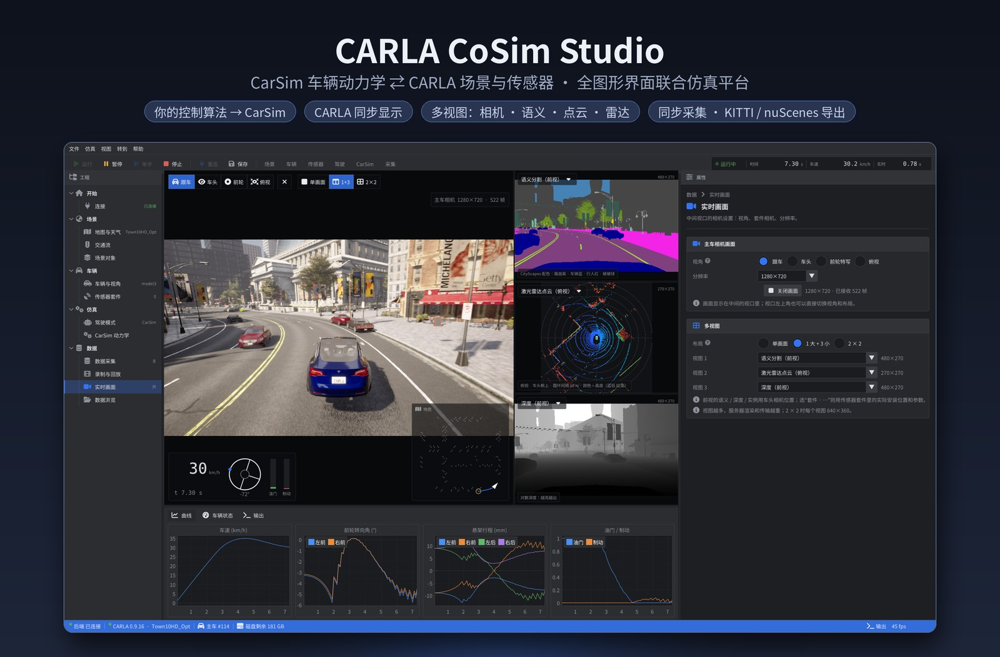
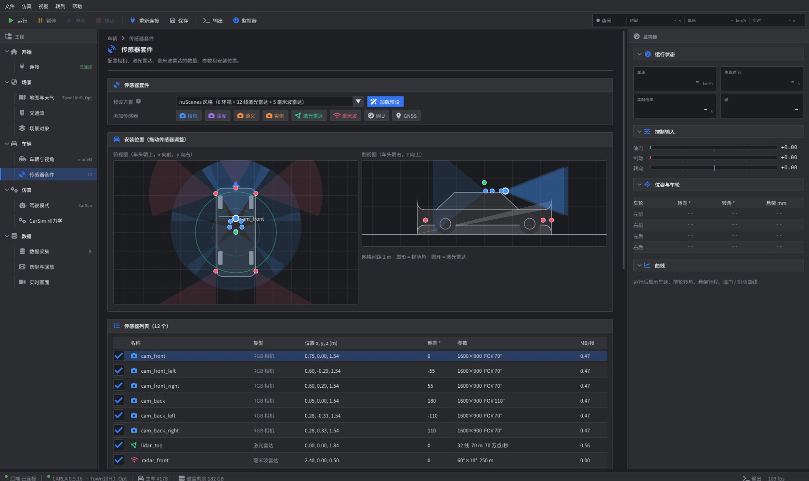
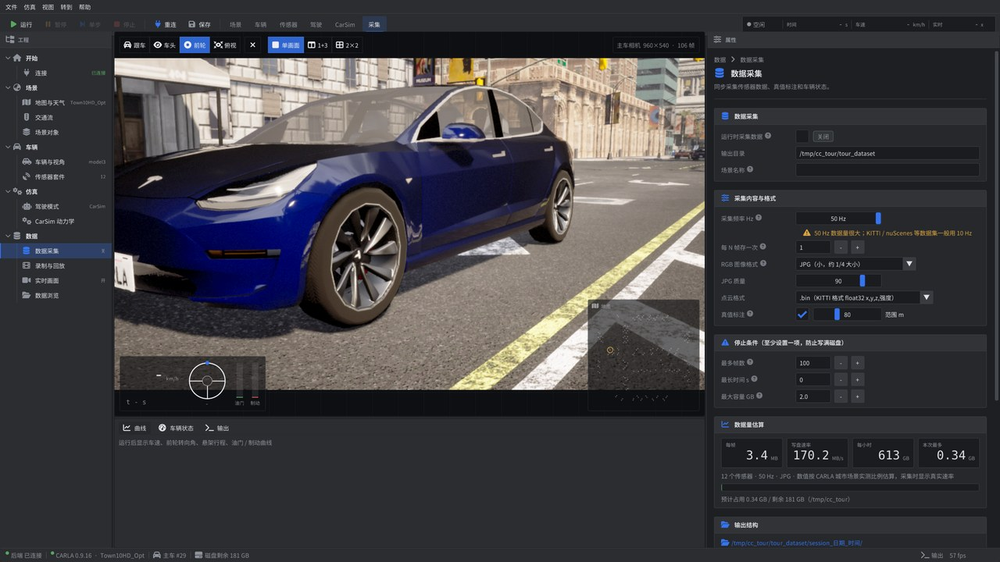
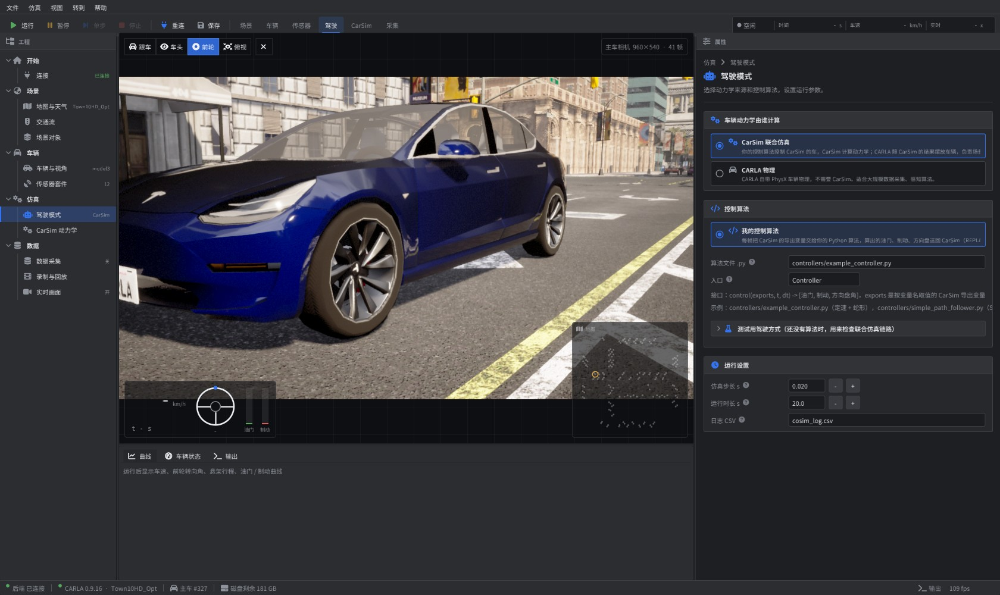
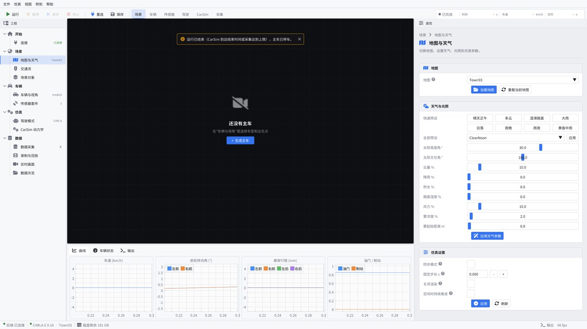
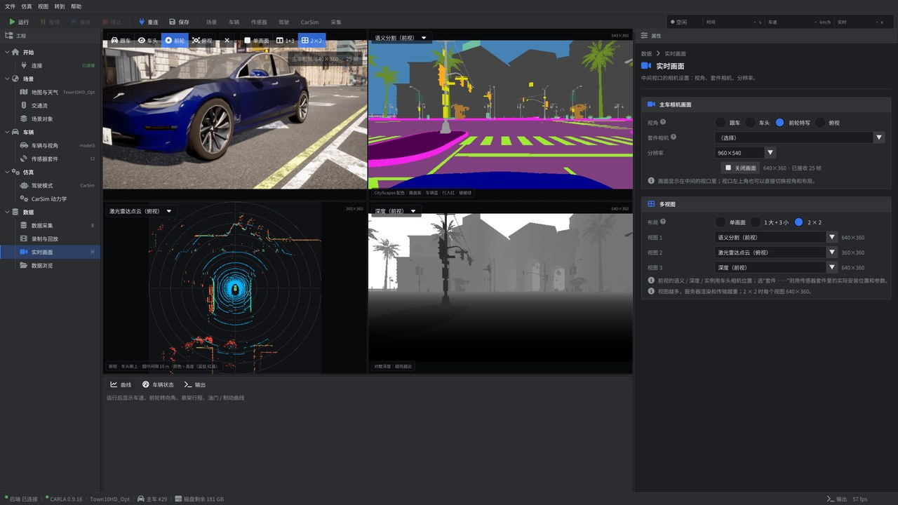
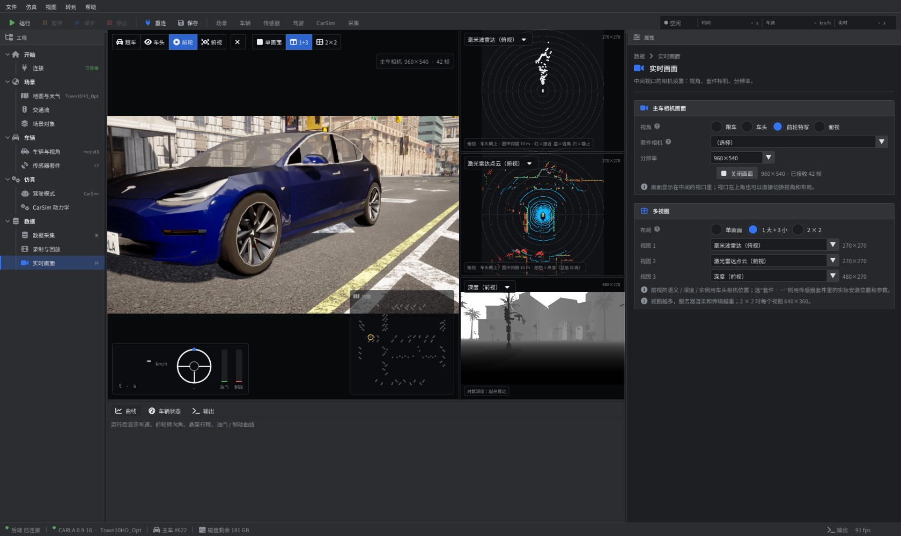
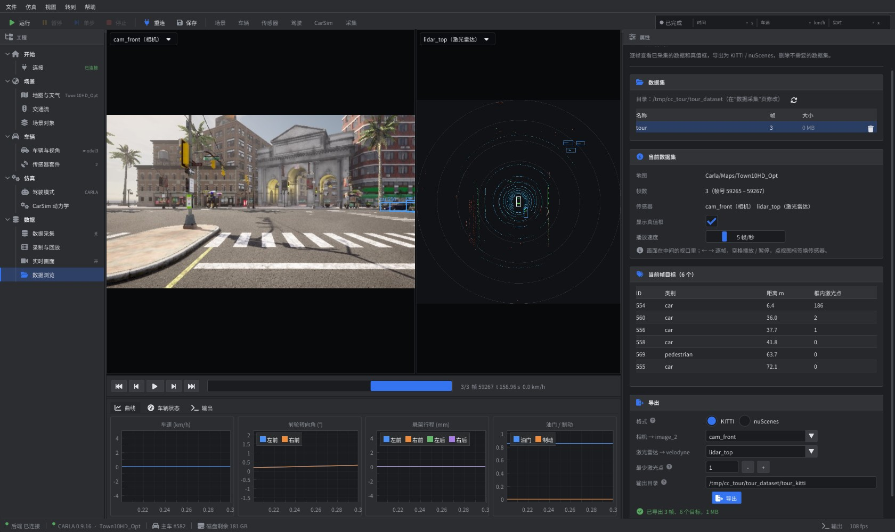

<p align="center"></p>

# CARLA CoSim Studio

> **作者：Claude Opus 5.5**（Anthropic）。本仓库的代码、图形界面、CARLA 补丁、脚本、测试和文档均由 Claude Opus 5.5 编写。
>
> **CarSim 接口基于 [python_carsim_env](https://github.com/dyZhou2001/python_carsim_env)（原作者 [dyZhou2001](https://github.com/dyZhou2001)）**，这是本项目能与 CarSim 联合仿真的基础，衷心感谢原作者的开源工作。见下方说明。

## 目录

- [🔗 基础：python_carsim_env](#-基础python_carsim_env)
- [📖 使用文档](#-使用文档)
- [远程使用：笔记本 + 云服务器](#远程使用笔记本--云服务器)
- [原版 CARLA 与改版 CARLA](#原版-carla-与改版-carla)
  - [本仓库里有什么，没有什么](#本仓库里有什么没有什么)
  - [怎么编译改版 CARLA](#怎么编译改版-carla)
  - [Python 的 carla 包也分原版和改版](#python-的-carla-包也分原版和改版)
- [功能](#功能)
- [架构](#架构)
- [仓库结构](#仓库结构)
- [快速开始](#快速开始)
  - [1. CARLA](#1-carla)
  - [2. 后端](#2-后端)
  - [3. 界面](#3-界面)
  - [4. 启动](#4-启动)
  - [5. 使用（详细步骤见上面的使用指南）](#5-使用详细步骤见上面的使用指南)
  - [6. 接入你的控制算法](#6-接入你的控制算法)
  - [7. 测试避障：高速施工封道](#7-测试避障高速施工封道)
  - [8. KMPPI 路径跟踪（没有 CarSim 时用 Chrono 宝马）](#8-kmppi-路径跟踪没有-carsim-时用-chrono-宝马)
- [坐标与同步](#坐标与同步)
- [测试](#测试)
- [CARLA 0.9.16 自身的已知问题](#carla-0916-自身的已知问题)
  - [改版 CARLA 的补丁已修复](#改版-carla-的补丁已修复)
  - [CARLA 修不了，本项目的代码已绕开](#carla-修不了本项目的代码已绕开)
  - [仍然存在](#仍然存在)
- [已知限制](#已知限制)
- [致谢](#致谢)

**CarSim ⇄ CARLA 联合仿真平台** —— 像 CarSim 一样，全部通过图形界面操作 CARLA。

**你的控制算法控制 CarSim 里的车，CarSim 计算车辆动力学，CARLA 负责场景、渲染和传感器。** 每一帧 CarSim 算出的车身位姿、四轮转向角、车轮转速、悬架行程都同步到 CARLA 车辆上，CARLA 自己不算动力学，只照 CarSim 的结果摆放车辆，**转向机构一致**。再配上多视图、传感器套件编辑、数据采集与导出、场景和交通等功能，不写代码也能完成仿真和数据集生产。

```
你的控制算法 (Python) ──油门 / 制动 / 方向盘──▶ CarSim（车辆动力学，经 python_carsim_env 调用）
                                                    │ 位姿 · 车轮 · 悬架（每帧）
                                                    ▼
                          CARLA（场景 · 交通 · 相机 / 激光雷达 / 毫米波雷达 · 画面 · 数据采集）
```

## 🔗 基础：python_carsim_env

[**python_carsim_env**](https://github.com/dyZhou2001/python_carsim_env) 由 **[dyZhou2001](https://github.com/dyZhou2001)** 最初开发并以 MIT 许可证开源，它用 Python（ctypes）直接调用 CarSim 的 VS Solver API（`vs_read_configuration` → `vs_integrate_io` → `vs_terminate_run`），把一次 CarSim 运行封装成 gym 风格的环境：`CarSimEnv.reset()` 读入 `.sim` 并初始化，`CarSimEnv.control_step(action, inner_steps)` 写入导入变量（油门、制动、方向盘）、积分若干步并返回全部导出变量。

本平台和 CarSim 有关的部分都建立在它之上：

| 本平台的功能 | 用到 python_carsim_env 的地方 |
|---|---|
| 联合仿真 | 每一帧调用 `control_step`，CarSim 积分 `帧周期 / t_step` 步，导出变量再同步到 CARLA |
| 你的控制算法 | 算法返回的油门 / 制动 / 方向盘就是 `control_step` 的 action，按 `.sim` 里的导入变量顺序写入 |
| 示例算法 | `controllers/simple_path_follower.py` 直接使用其中的 `SimplePathFollower` |
| 强化学习 | 同一套 `CarSimEnv` 接口（python_carsim_env 里有 SAC 示例）；训练代码里用 `CarlaVehicleSync` 按界面保存的配置把车同步到 CARLA（见使用指南“命令行与强化学习”），CARLA 的传感器用 CARLA 自己的 API 挂 |

**感谢 [dyZhou2001](https://github.com/dyZhou2001) 开源 python_carsim_env**：没有这个 Python ⇄ CarSim 的接口，就没有本平台的联合仿真。

版本来源：[dyZhou2001/python_carsim_env](https://github.com/dyZhou2001/python_carsim_env)（原始仓库）→ [yongqianxiao/python_carsim_env](https://github.com/yongqianxiao/python_carsim_env)（fork）→ [Mrchengyuan/python_carsim_env](https://github.com/Mrchengyuan/python_carsim_env)（fork）。本平台用最后这个版本开发和测试；本仓库不包含 python_carsim_env 的代码，只在运行时调用它，使用和再分发请遵守其 MIT 许可证。

使用时把它 clone 到本仓库根目录（界面“CarSim 动力学”页的“python_carsim_env 目录”默认就是 `../python_carsim_env`）：
```bash
git clone https://github.com/Mrchengyuan/python_carsim_env
```
没有 CarSim 许可证时，界面里勾选“模拟 CarSim”，用内置的简化车辆模型代替，先把整条链路跑通（这时工具栏读数框里有黄色“模拟 CarSim”标记）。

## 📖 使用文档

| 文档 | 内容 |
|---|---|
| **[Ubuntu 使用指南](docs/Ubuntu使用指南.md)** | 从零安装、原版 / 改版 CARLA、Python 环境、编译界面、桌面一键启动、命令行、测试、常见问题 |
| **[Windows 使用指南](docs/Windows使用指南.md)** | 从零安装、CARLA、Python、界面、一键启动、**接入 CarSim**、改版 CARLA、常见问题 |
| **[远程使用指南](docs/远程使用指南.md)** | 笔记本只有集成显卡时：CARLA、后端和控制算法在云服务器上，笔记本只运行 CarSim 和界面，每次双击启动器 `启动远程仿真.exe` |
| **[界面操作手册](docs/界面操作手册.md)** | 每个页面、每个按钮的说明，数据采集输出格式，常用操作流程 |
| **[控制算法编写指南](docs/控制算法编写指南.md)** | 自己写控制算法：文件格式、每帧拿到的数据、返回值、放到服务器、调试和常见报错、5 个示例 |
| [CarSim 导出变量清单](carsim_carla_bridge/docs/CarSim导出变量清单.md) | CarSim 里要导出哪些变量、单位、坐标约定 |
| [Windows 编译指南](carsim_carla_bridge/docs/Windows编译指南.md) | 在 Windows 上编译改版 CARLA |

## 远程使用：笔记本 + 云服务器

笔记本跑不动 CARLA 时，**CARLA、后端和你的控制算法在云服务器（GPU）上运行，笔记本只运行 CarSim 求解器和界面**，两边只靠笔记本发起的一条 SSH 连接（笔记本不需要公网 IP）。用户解压一次 Windows 启动包，之后每次双击启动器 **`启动远程仿真.exe`**：它检查笔记本（Python、numpy、SSH、端口，有问题当场说明怎么处理，缺 numpy 一键安装），连上云服务器，启动 CarSim 服务，然后打开界面；网络断了自动重连，关闭界面自动断开。控制算法不用改，算法看到的仍是 CarSim 坐标和单位；联合仿真仍然逐帧同步，网络只影响速度，不影响结果。

- 用户：[远程使用指南](docs/远程使用指南.md)（什么在哪里运行、一次性设置、启动器、示例路径跟踪算法、常见问题、结果在服务器的哪里）。
- 服务器：`scripts/remote_session.sh`（SSH 连接上来时运行：按需启动改版 CARLA，运行并看护后端）、`scripts/install_remote_key.sh`（只能建立这条连接的受限钥匙）、`scripts/build_remote_package.sh`（打 Windows 启动包），见指南的“给服务器管理员”一节。

## 原版 CARLA 与改版 CARLA

本平台能用两种 CARLA。**两种都能和 CarSim 联合仿真，画面上的同步效果完全一样**，区别只在速度 / IMU 读数和悬架动画。**不确定就先用原版。**

- **原版 CARLA**：官方发布的 [CARLA 0.9.16](https://github.com/carla-simulator/carla/releases/tag/0.9.16)，下载解压就能用。每一帧由后端把车直接摆到 CarSim 算出的位置（界面上叫“兼容模式”）。
- **改版 CARLA**：官方 0.9.16 源码打上本仓库的补丁 [`carla_patches/carla_0.9.16_external_dynamics.patch`](carla_patches/carla_0.9.16_external_dynamics.patch) 后**自己编译**得到。补丁给 CARLA 增加“外部动力学接口”：CarSim 每一帧把完整的车辆状态（位置、姿态、速度、角速度、四轮转向角、车轮转角、悬架行程）一次交给 CARLA，CARLA 里的速度和传感器读数因此是真实值。

| | 原版 CARLA | 改版 CARLA |
|---|---|---|
| 怎么得到 | 从官方下载（约 8 GB） | 自己编译：Ubuntu 约 150 GB 磁盘、2–3 小时；Windows 约 165–200 GB；GitHub 账号要先关联 Epic Games |
| 车身位置、姿态 | ✅ 同步 | ✅ 同步 |
| 四轮转向角、车轮转动 | ✅ 同步 | ✅ 同步 |
| 悬架行程（车轮上下跳动） | ❌ 没有 | ✅ 同步 |
| CARLA 里的 `get_velocity()`、角速度、IMU 陀螺仪 | ❌ 读数为 0（IMU 加速度计是摆放位置的差分，噪声大） | ✅ CarSim 的真实值 |
| 界面“连接”页显示 | 黄色“原版 CARLA：兼容模式”（或“服务器是原版 CARLA：兼容模式”） | 绿色“改版 CARLA：可用” |
| 默认端口 | 2000 | 3000 |
| Ubuntu 桌面图标 | **CARLA CoSim Studio** | **CARLA CoSim Studio（改版）** |

**什么时候需要改版**：要用 CARLA 自己的速度、IMU 传感器读数（例如采集的数据集里要有 IMU，或别的程序通过 `get_velocity()` 读车速），或者要看到悬架动画。只是调控制算法、看画面、采集相机 / 语义分割 / 深度 / 激光雷达 / 毫米波雷达数据，原版就够了。

### 本仓库里有什么，没有什么

| 有 | 没有 |
|---|---|
| 对 CARLA 的全部改动：`carla_patches/carla_0.9.16_external_dynamics.patch`（外部动力学接口；另外修复了 CARLA 0.9.16 自身的几个错误：读取卡车、巴士等多轮车辆物理参数时让服务器崩溃的越界；交通车被撞飞或掉出世界时交通管理器死循环、让仿真卡死；CARLA 服务器退出或卡顿时，客户端库的后台线程（交通管理器、世界状态推送）直接把整个 Python 进程中止；新生成的交通车速度上限读到垃圾值时交通管理器递归查找交通标志直到栈溢出） | **编译好的改版 CARLA**（也没有原版 CARLA，原版请从官方下载） |
| `carla_patches/carla_0.9.16_release_gil.patch`：Python 包里 `apply_external_state()`、`get_wheel_steer_angle()` 等待服务器时释放 Python 全局锁（否则和大画面的相机回调互相等待，整个仿真卡死）。要在主补丁之后打 | |
| Linux 编译用的修复补丁：`carla_patches/carla_0.9.16_linux_libpng_url_fix.patch` | |
| 一键编译脚本：`scripts/build_ue4.sh`、`scripts/build_carla.sh` | |
| 启动脚本：`scripts/carla_mod_server.sh`、`scripts/start_studio.sh mod` | |
| 编译教程：[Ubuntu 使用指南 第 8 节](docs/Ubuntu使用指南.md)、[Windows 编译指南](carsim_carla_bridge/docs/Windows编译指南.md) | |

为什么不直接上传编译好的改版 CARLA：一是太大（CARLA 源码加地图资源约 31 GB，它依赖的定制版 UE4 引擎约 93 GB）；二是 UE4 引擎的代码只对关联了 Epic Games 的 GitHub 账号开放，不能再分发。所以每台电脑需要自己编译一次，脚本已经把步骤都写好了。

### 怎么编译改版 CARLA

**Ubuntu 22.04**（本平台就是在这个环境下编译和测试的）。完整步骤和常见问题见 [Ubuntu 使用指南 第 8 节](docs/Ubuntu使用指南.md)，概要：

1. 把 GitHub 账号关联到 Epic Games（免费，只需一次），这样才有权限下载 CARLA 定制版 UE4。
2. `./scripts/build_ue4.sh`：下载并编译 UE4，约 1 小时、95 GB。
3. `./scripts/build_carla.sh`：下载 CARLA 0.9.16 源码到 `carla_src/` → 打上 `carla_patches/` 里的补丁 → 下载地图资源 → 编译 Python 包和 CARLA，约 1 小时。运行前先 `source venv/bin/activate` 并装好 CARLA 的编译依赖（命令见指南 8.3）。
4. 把编译出的改版 Python 包装进单独的环境 `venv_build`：
   ```bash
   python3 -m venv venv_build
   venv_build/bin/pip install carla_src/PythonAPI/carla/dist/carla-0.9.16-cp310-cp310-linux_x86_64.whl numpy pillow shapely networkx
   venv_build/bin/python -c "import carla; print(hasattr(carla.Vehicle, 'apply_external_state'))"   # 输出 True 就对了
   ```
5. `bash scripts/install_desktop_icons.sh`，双击桌面上的 **CARLA CoSim Studio（改版）**。第一次启动要编译着色器（20–40 分钟），以后约 40 秒（本机实测 42 秒）。
6. 验证：`venv_build/bin/python carsim_carla_bridge/tests/test_modified_carla.py --port 3000`，应该全部 PASS（最后一行是 `ALL MODIFIED-CARLA TESTS PASSED`；有一项 FAIL 时退出码为 1）。

双击图标后 CARLA 没起来或中途消失：看 `~/.cache/carla_cosim_studio/launch_mod.log`（启动过程、CARLA 何时退出）和 `~/.cache/carla_cosim_studio/stop.log`（每次关闭 CARLA 是谁、因为什么），详见 [Ubuntu 使用指南 常见问题](docs/Ubuntu使用指南.md)。启动时关掉“正在启动”进度窗口不影响启动。

**Windows**：按 [Windows 编译指南](carsim_carla_bridge/docs/Windows编译指南.md)（需要 VS 2022；流程和官方 0.9.16 一样，只是编译前多打一个补丁）。Windows 上的编译步骤还没有在实机上完整走过一遍。

### Python 的 carla 包也分原版和改版

后端通过 Python 的 `carla` 包和 CARLA 通信，这个包也有两种：

| 包 | 怎么装 | 能连 |
|---|---|---|
| 原版包 | `pip install carla==0.9.16`（Ubuntu 上装在 `venv`） | 原版和改版 CARLA 都能连，但**都只能用兼容模式** |
| 改版包 | 编译改版 CARLA 时生成的 `.whl`（Ubuntu 上装在 `venv_build`） | 连改版 CARLA 用外部动力学接口；连原版 CARLA **自动改用兼容模式** |

交通管理器（控制背景交通车的 CARLA 模块）运行在 Python 包里，不在服务器里。CARLA 0.9.16 的 Python 包有几个错误：一辆交通车被撞飞或掉出世界时交通管理器陷入死循环，整个仿真卡住；CARLA 服务器退出或卡顿超过 20 秒时，它的后台线程直接把整个后端进程中止。**改版包修好了这些错误，连原版 CARLA 时也有效**。用原版包时：后端只在生成交通、使用自动驾驶时才启动交通管理器；出问题时界面会提示并提供“重启后端”按钮。

- 要用改版的功能，**CARLA 服务器和 Python 包都必须是改版**。
- Ubuntu 桌面图标和 `start_studio.sh`：有 `venv_build` 就用它，否则用 `venv`，不用手动切换。
- 界面“CarSim 动力学”页的“CARLA 接口”默认是“自动”，保持默认即可。
- 当前用的是哪种，看界面“连接”页“外部动力学接口”那一行。

## 功能

| 模块 | 能做什么 |
|---|---|
| **CarSim 联合仿真** | CarSim 与 CARLA 同步步进；四轮实际转向角（阿克曼、转向柔度一比一）、车轮转速（可看出打滑 / 抱死）、悬架行程、车身侧倾俯仰全部同步；导出变量可视化编辑与校验 |
| **驾驶模式** | **CarSim 联合仿真**：你的 Python 控制算法（每次运行自动重新加载，改完代码直接再运行）控制 CarSim，CARLA 照 CarSim 结果同步；测试用演示 / 路线跟随 / 键盘驾驶。**CARLA 物理**（不需要 CarSim）：路线跟随、CARLA 自动驾驶（遵守红绿灯、跟车）、键盘驾驶 |
| **场景信息（给控制算法）** | 每帧把 CARLA 场景里自车 50 m 内的**车辆、行人、停放车辆、测试场景的锥桶 / 护栏**（全局和相对自车的位置、速度、航向、中心距离、包围盒间距、尺寸）、**前方车道**（车道宽、偏离量、航向偏差、曲率、中心线、车道线、相邻车道、限速、路口、红绿灯）和可选的**传感器数据**（numpy 图像 / 点云 / 雷达）交给你的 Python 控制算法；**一切按 CarSim 的坐标系和单位**；像 CarSim 选输出变量一样**勾选**要哪些量（给算法和写进记录分开选）；**碰撞检测**（CarSim 的车在 CARLA 里撞上也不会停）可选停止运行或记录；底部“场景”标签实时显示（俯视图 + 表格） |
| **测试场景（高速施工封道）** | 在出生点前方指定的车道用**锥桶或护栏**封道（渐变段 + 封闭段 + 箭头导向牌），每次运行摆在同样的位置，用来测试避障 / 换道算法；预设按 **Town04 高速**起点（单向 4 车道，自动找出生点）：封闭本车道、封闭左侧车道、连续两处封道、只剩一条车道，距离 / 车道 / 长度 / 类型都可改；锥桶和护栏作为 `type = "static"` 的障碍物交给算法，撞上计入碰撞，`run.json` 记下摆了什么 |
| **运行记录** | 每次运行一个文件夹（`runs/时间_算法文件名/`，不覆盖以前的）：从开始时刻起按采样周期把勾选的自车量、障碍物、车道、CarSim 导出变量和控制算法的输出写成 CSV（障碍物每行一个，和数据采集同一套采样时刻），另存这次的配置、算法文件副本和 `run.json`（地图、出生点、种子、结束原因、运行指标）；运行结束时输出窗口给出文件夹和运行指标（车道偏移、航向偏差、碰撞、前方最小间距、行驶距离、最大 \|Ay\|，CarSim 单位） |
| **传感器套件** | 预设 单前视 / KITTI / nuScenes / 量产车 / 感知真值，按车型尺寸自动布置；俯视图 + 侧视图拖动安装，显示视场角；相机、深度、语义、实例、激光雷达、毫米波雷达、IMU、GNSS |
| **数据采集** | 所有传感器同一帧同步采样；图像 JPG/PNG、点云 .bin/.npy、雷达 CSV；自动生成标定文件（内参 K、外参）、3D 真值框、车辆状态；采集前估算数据量，没有停止条件或空间不足时拒绝开始 |
| **数据浏览与导出** | 逐帧浏览已采集的数据（相机图上叠加 3D 真值框、激光雷达 / 毫米波雷达俯视图、目标列表、播放）；一键导出为 **KITTI** 或 **nuScenes** 格式（nuScenes 可直接用官方工具读取）；删除不需要的数据集 |
| **场景** | 地图切换、天气预设和 9 个参数、背景交通流（车辆 + 行人）、场景对象管理、录制与回放 |
| **视口与监视** | 仿真软件式布局：中间是实时 3D 画面（跟车 / 车头 / 前轮特写 / 俯视 / 任意套件相机），叠加车速、方向盘、踏板仪表和带轨迹的小地图；**多视图**（单画面 / 1+3 / 2×2）同时显示相机、语义分割、深度、实例分割、激光雷达点云和毫米波雷达俯视图；底部面板有实时曲线、车辆状态（位姿、四轮数据）、场景（周围的车、行人和车道）、输出日志 |
| **运行控制** | 运行 / 暂停 / 单步 / 继续 / 停止（F5 / F6 / F10 / Shift+F5）；停止或到时结束后主车停车；运行因到时、出错结束时画面上方提示原因；运行时长默认 0 = 一直运行（真实 CarSim 最晚到 .sim 的结束时间） |
| **界面** | 菜单栏 + 工具栏（按流程的页签）、左侧工程树、右侧属性面板、底部曲线 / 状态 / 场景 / 输出，各区域可拖动调整大小；深色 / 浅色主题，中文界面；配置保存为 JSON，命令行和强化学习训练共用 |

| 传感器套件编辑 | 数据采集 |
|---|---|
|  |  |
| **驾驶模式** | **浅色主题** |
|  |  |
| **多视图 2×2：相机 · 语义分割 · 激光雷达 · 深度** | **多视图 1+3：相机 · 毫米波雷达 · 激光雷达 · 深度** |
|  |  |
| **数据浏览：相机 + 3D 真值框 · 激光雷达俯视 · 目标列表 · 导出** | |
| **界面布局** | 像 Visual Studio、CarMaker 那样的可停靠面板：工程、画面、属性、曲线、车辆状态、场景、轨迹、输出都能拖动页签重新排布、叠成页签、浮动在主窗口里、关闭再打开，分隔条随意调大小；布局自动保存，一键恢复默认 |
| **算法自己的曲线** | 控制算法写 `self.debug = {名字: 数字}`，“曲线”面板实时画出、运行记录里存成 `log_debug.csv` |
| **运行对比** | 每次运行的记录列成表（算法、车辆、地图、时长、偏差、碰撞），勾选最多 4 次并排比较指标（最好的标绿），对比面板叠画轨迹、车速、车道偏差、控制输出和算法自己的 `self.debug` 量 |
|  | |

## 架构

```
┌─ CARLA CoSim Studio ─────────┐  本机 TCP / JSON   ┌─ backend_server.py ──────────────┐   RPC   ┌─ CARLA 0.9.16 ─────────┐
│ C++17 · Dear ImGui · ImPlot  │ ── 命令 ─────────▶ │ carla 客户端                     │ ──────▶ │ 原版：兼容模式          │
│ 界面、传感器套件编辑、曲线    │ ◀─ 实时数据 / 画面 │ CarSim 桥接 · 驾驶 · 数据采集    │         │ 改版：外部动力学接口    │
└──────────────────────────────┘                    └──────────────┬───────────────────┘         └────────────────────────┘
                                                                   │ ctypes (VS API)
                                                           ┌───────▼────────┐
                                                           │ CarSim 求解器   │
                                                           └────────────────┘
```

- 改版 CARLA：`carla_patches/` 给 CARLA 0.9.16 新增 `vehicle.enable_external_dynamics()` / `vehicle.apply_external_state()`，一帧一次下发位姿、速度、角速度、四轮转向 / 转角 / 悬架，`get_velocity()`、IMU 等读数为真实值。
- 原版 CARLA：自动用兼容模式（画面相同，速度类读数为 0，无悬架动画）。两者的区别见 [原版 CARLA 与改版 CARLA](#原版-carla-与改版-carla)。

## 仓库结构

| 目录 | 内容 |
|---|---|
| `cosim_gui/` | 图形界面源码，还有远程启动器（`launcher*.cpp`，启动包里叫 `启动远程仿真.exe`）；依赖（ImGui、ImPlot、GLFW、json、stb_image、Font Awesome）已放在 `third_party/`，编译不需要联网 |
| `carsim_carla_bridge/` | Python 后端、CarSim 桥接、驾驶模式、数据采集、测试和文档 |
| `carla_patches/` | CARLA 0.9.16 补丁（改版 CARLA 就是官方源码打上它们编译出来的）：外部动力学接口（含 CARLA 自身错误的修复）；Python 包等待服务器时释放全局锁；Linux 编译用的 libpng 地址修复 |
| `scripts/` | Ubuntu：`build_ue4.sh`、`build_carla.sh`、`carla_server.sh`、`carla_mod_server.sh`、`start_studio.sh`、`stop_carla.sh`、`install_desktop_icons.sh`，以及它们共用的 `env.sh`（路径、端口）和 `carla_stop_lib.sh`（关闭 CARLA）；远程使用的服务器端：`remote_session.sh`、`install_remote_key.sh`、`build_remote_package.sh`；`scripts/windows/`：`start_studio.bat`、`stop_carla.bat`、`install_shortcuts.bat`、`env.bat` |
| `docs/` | 使用文档（Ubuntu / Windows / 远程使用指南、界面操作手册、控制算法编写指南、场景与数据接口说明）；`docs/images/` 是截图 |

## 快速开始

### 1. CARLA
- **原版**（先用这个）：下载 [CARLA 0.9.16](https://github.com/carla-simulator/carla/releases/tag/0.9.16)，解压后直接运行。
- **改版**（可选）：本仓库只提供补丁和编译脚本，需要自己编译，见上面的 [原版 CARLA 与改版 CARLA](#原版-carla-与改版-carla)。

### 2. 后端
```bash
pip install numpy pillow shapely networkx
pip install carla==0.9.16          # 原版 carla 包；编译了改版 CARLA 就装改版的 .whl（见上文）
git clone https://github.com/Mrchengyuan/python_carsim_env   # CarSim 的 Python 接口，放在仓库根目录
```

### 3. 界面
**Windows**：从 [Releases](../../releases) 下载 `CARLA_CoSim_Studio_Windows.zip`，解压后运行 `carla_cosim_studio.exe`；或自行编译：
```bat
cd cosim_gui
cmake -S . -B build -G "Visual Studio 17 2022" -A x64
cmake --build build --config Release
```
**Ubuntu 22.04**：
```bash
sudo apt install build-essential cmake libx11-dev libxrandr-dev libxinerama-dev libxcursor-dev libxi-dev libgl1-mesa-dev fonts-noto-cjk
cd cosim_gui && cmake -S . -B build -DCMAKE_BUILD_TYPE=Release && cmake --build build -j
./build/carla_cosim_studio
```

### 4. 启动
- **Ubuntu 一键启动**：运行一次 `bash scripts/install_desktop_icons.sh`，桌面上会出现三个图标：
  - **CARLA CoSim Studio**：原版 CARLA + 界面。启动快、切换地图快，平时先用这个。
  - **CARLA CoSim Studio（改版）**：改版 CARLA + 界面。和 CarSim 联合仿真、需要速度 / IMU 读数和悬架动画完全同步时用；以编辑器模式运行，启动约 40 秒，第一次切换地图很慢，尽量用默认地图。
  - **关闭 CARLA**：关掉所有 CARLA 服务器。两个启动图标不要同时开。
- **Windows**：运行 `scripts\windows\install_shortcuts.bat` 创建桌面快捷方式，或先启动 CARLA 再打开 `carla_cosim_studio.exe`。

### 5. 使用（详细步骤见上面的使用指南）
1. 用桌面图标启动时界面会自动连接 CARLA；直接打开程序时，在 **连接** 页设置 Python 解释器、`carsim_carla_bridge` 目录后点 **连接 CARLA**。
2. **车辆与视角**：选车型和出生点（出生点也是 CarSim 坐标原点），生成主车后中间自动显示实时画面。
3. **CarSim 动力学**：填 `.sim` 文件和导出变量（见 [导出变量清单](carsim_carla_bridge/docs/CarSim导出变量清单.md)）；没有 CarSim 许可证可勾选 **模拟 CarSim** 先跑通链路。
4. **驾驶模式**：选 **CarSim 联合仿真**，在“算法文件 .py”里填你的控制算法（写法见下面）。
5. **传感器套件 / 数据采集** 按需设置，按 **F5** 或点工具栏 **运行**；点 **停止** 结束，主车会停住。

### 6. 接入你的控制算法
`.sim` 里的油门、制动、方向盘导入变量保持 **REPLACE**（和 python_carsim_env 一样）。写一个 Python 文件，例如 `carsim_carla_bridge/controllers/my_controller.py`：
```python
class Controller:
    def reset(self):                          # 可选，每次运行开始调用一次
        self.integral = 0.0

    def control(self, exports, t, dt):        # 每帧调用一次
        vx = exports["Vx"]                    # 按变量名取 CarSim 导出变量（CarSim 单位）
        ...                                   # 你的算法
        return [throttle, brake, steer_sw]    # 按 .sim 里导入变量的顺序

    def finish(self, reason):                 # 可选，每次运行结束调用一次（reason = 结束原因）
        ...
```
- `exports`：全部 CarSim 导出变量，键是导出变量名；`t`：CarSim 时间；`dt`：控制周期（= 仿真步长）。
- `finish(reason)`：可选，运行结束（到时、碰撞停止、停止、出错）时调用一次，`reason` 与输出窗口里的结束原因相同；入口是函数时写模块级 `finish(reason)`。出错只提示，不影响收尾。
- 界面里的相对路径以 `carsim_carla_bridge` 目录为准（命令行里以当前目录为准）；每次点“运行”都会重新加载这个文件（连同它从同一目录和子目录 import 的文件），改完代码直接再运行，不用重启界面。
- 示例：`controllers/example_controller.py`（定速 + 蛇形）、`controllers/path_follower.py`（路径跟踪：纯跟踪沿 CARLA 的车道中心线，弯前降速，路口不跟错车道，见[远程使用指南第 5 节](docs/远程使用指南.md#5-示例控制算法路径跟踪controllerspath_followerpy)）、`controllers/scene_controller.py`（沿车道行驶，前方有车或障碍物就跟车 / 停车）、`controllers/lane_change_avoid.py`（避障：在 path_follower 的基础上，本车道被锥桶、护栏、停着的车挡住就换道绕过去，过去后换回原车道；左右都换不了就减速停车；要在“场景信息”页车道里加勾 `left_lane`、`right_lane`，和 path_follower.py 放在同一个文件夹）、`controllers/simple_path_follower.py`（python_carsim_env 里的 SimplePathFollower）。

**用 CARLA 场景里的信息**：把 `control` 写成 4 个参数，每帧就会多收到一个 `scene`（算法本来就在 Python 后端里运行，场景信息直接从 CARLA 读出来交给它，不经过界面；界面只是把同一份数据显示出来）。只写 3 个参数的算法照旧运行。
```python
    def control(self, exports, t, dt, scene):
        for o in scene["objects"]:            # 自车 50 m 内的障碍物，由近到远
            o["id"], o["type"]                # 编号（整次运行不变）；"vehicle" 车辆（地图里停放的车 o["parked"] 为 True）、
                                              # "walker" 行人、"static" 测试场景的锥桶 / 护栏 / 导向牌
            o["rel_x"], o["rel_y"]            # 相对位置，自车坐标系（x 向前、y 向左），m
            o["rel_vx"], o["rel_vy"]          # 相对速度，km/h（rel_vx 为负 = 在靠近）
            o["dist"], o["gap"]               # 中心距离、包围盒间距，m
        lane = scene.get("lane")              # width、offset、heading_err、center_rel ...
        ego = scene["ego"]                    # ego["X"]、ego["Y"]、ego["Yaw"] = CarSim 的 Xo、Yo、Yaw
        return [throttle, brake, steer_sw]
```
**一切按 CarSim**：全局坐标系就是 CarSim 的全局坐标系（原点在出生点），自车坐标系原点在 CarSim 参考点，x 向前、y 向左（左为正）；速度、角度用 CarSim 的导出单位（默认 km/h、deg）。在 **场景信息** 页勾选要哪些量：每个量有“给算法”和“记录”两个勾选框，分开选，以及碰撞时停止运行、只记录还是不检测。每个变量的定义见 [场景与数据接口说明](docs/场景与数据接口.md)。

命令行和强化学习训练用同一份配置：
```bash
cd carsim_carla_bridge                     # 配置里的相对路径（控制算法、日志）都以这个目录为准
python run_cosim.py --config cosim_config.json                                   # 界面保存的配置（只支持 CarSim 联合仿真）
python run_cosim.py --sim simfile.sim --controller controllers/my_controller.py --duration 0
python run_cosim.py --mock --duration 20                                         # 不需要 CarSim
```

### 7. 测试避障：高速施工封道

在 Town04 高速上用锥桶 / 护栏封闭车道，看你的算法能不能换道绕过去。每次点“运行”都会先清掉上一次的锥桶、再按同样的位置摆好，所以每次运行的场景完全一样，改完算法直接再运行对比。

1. **测试场景** 页（工程树“仿真 → 测试场景”）：点 **切到 Town04 高速起点**。界面会加载 Town04，并把出生点设成高速上的起点：单向 4 车道，车在左数第 2 条，前方约 850 m 没有路口。
2. 点一个**预设**，下表随之填好，“运行时摆放封道”自动打开：

   | 预设 | 摆放 | 考验什么 |
   |---|---|---|
   | 封闭本车道（锥桶） | 250 m 处起封闭车所在车道：渐变段 40 m + 封闭 100 m | 换道绕开，再换回来 |
   | 封闭左侧车道（护栏） | 250 m 处起用护栏封闭左边一条车道 | 本车道不用让：不能误判 |
   | 连续两处封道 | 250 m 封本车道，550 m 封左侧车道 | 往左绕开后要及时换回来 |
   | 只剩一条车道 | 300 m 处封闭本车道和右边两条 | 只剩最左一条能走 |

   表里每一处都能改：**距离**（从出生点沿道路算，m）、**车道**（相对出生时所在的车道：本车道、左侧 / 右侧第 1~3 条）、**渐变段**、**封闭长度**、**类型**（锥桶 / 护栏）；也可以“添加一处封道”，或点垃圾桶删掉一处。
3. **场景信息** 页：障碍物种类里“施工锥桶 / 护栏”默认已勾。**碰撞**选“停止运行”（撞上就结束）或“记录并继续”。用自带的避障示例时，还要在**车道**一栏把 `left_lane`、`right_lane` 勾上“给算法”（默认没勾）。
4. **驾驶模式** 页：算法文件选你的避障算法，或先用自带示例 `controllers/lane_change_avoid.py`（入口 `Controller`）。
5. 点 **运行**。输出窗口会写出摆了什么，例如“测试场景：第 1 处，出生点前方 250 m，本车道，渐变段 40 m + 封闭 100 m，55 个锥桶”（含导向牌）；避障示例还会打印“本车道前方 50 m 被挡住，向左换道”“原车道已经空了，向右换回去”。

**算法里怎么拿到锥桶**：锥桶、护栏、导向牌是 `scene["objects"]` 里 `type == "static"` 的目标，和车辆一样用 CarSim 坐标（x 向前、y 向左，原点在参考点）：
```python
def control(self, exports, t, dt, scene):
    cones = [o for o in scene["objects"] if o["type"] == "static"]
    ahead = [o for o in cones if o["rel_x"] > 0 and abs(o["rel_y"]) < 2.0]   # 本车道前方的
    nearest = min((o["gap"] for o in ahead), default=None)                   # 到自车包围盒的最近距离，m
    lane = scene["lane"]                                                     # 车道：width、offset、center_rel……
    ...
```

**自带避障示例** `controllers/lane_change_avoid.py`：路径跟踪沿用 `path_follower.py`（两个文件要放在同一个文件夹）。本车道前方被静止的东西（锥桶、护栏、停着的车）挡住时，它会先检查换道轨迹上有没有东西、旁边车道后方有没有更快的车，安全才换道；原车道空出来后再换回去；左右都走不通就在障碍物前 5 m 停下。换道时间、安全距离在文件开头改，轴距、目标车速、制动量程在 `path_follower.py` 开头改。在上面 4 个预设下都不碰撞，离锥桶最近约 0.65 m（`tests/test_avoid_carla.py`）。

**看结果**：这次运行文件夹里的 `run.json`，其中 `kpi.collisions` 是碰撞次数，`kpi.min_gap_ahead` 是前方最小间距，`scenario` 记下这次摆了哪些封道；`log_objects.csv` 里是每个时刻的锥桶位置。

别的地图、别的出生点也能用：距离和车道都相对出生点算，只要那里有对应的车道和足够长的路；摆不下时运行不会开始，并提示原因。详细说明见[界面操作手册](docs/界面操作手册.md)第 9 节“测试场景页”。

### 8. KMPPI 路径跟踪（没有 CarSim 时用 Chrono 宝马）

`controllers/kmppi/` 是 KMPPI 路径跟踪算法，移植自 MATLAB 工程 `kmppi`（及其 Python 版 `kmppi_chrono`）。算法本身原样照搬：`kmppi_controller.py`（RBF 核参数化 P = 9、时域 T = 33 步 × 0.05 s、导数动作提升、对称采样 K = 2048、自适应温度 ESS ≈ 16、每周期 2 次 refinement）、`prediction_model.py`（3DOF 动态自行车 + Pacejka）、`kmppi_config.py` 和 `bmw_e90_identified.json`（全部参数）。只新增两个文件：

- `lane_reference.py`：参考轨迹从八字换成 CARLA 的车道中心线（`scene["lane"]["center_rel"]`，默认就给算法），恒速 20 m/s；参考的 vy、r 仍按原工程的稳态自行车关系由曲率求得。
- `controller.py`：接到平台上的一层。把参考点（前轴中心）的导出量换算到质心，每 0.05 s 算一次、中间各帧保持。输出 `[纵向加速度 ax (m/s²), 前轮转角 δ (rad，左为正)]`，就是原工程被控对象的输入。

使用：**驾驶模式** 页算法文件选 `controllers/kmppi/controller.py`（入口 `Controller`）；仿真步长不用改：`controller.py` 开头写了 `FRAME_DT = 0.05`，平台运行时自动用 0.05 s（输出窗口会说明）；出生点用 **测试场景** 页的“切到 Town04 高速起点”。KMPPI 只跟踪路径、不避障：代价里没有障碍物项（原工程就是这样）。

**没有 CarSim 时：Chrono 宝马 E90 替身**（`chrono_bmw/`）。它包装 `kmppi_chrono` 的 `chrono_plant.py`：命令适配原样，四轮加扭矩、转向按标定表；对外接口与 CarSim 相同，导出变量按 CarSim 的名字、坐标和单位给出。前轮转角已扣除 E90 约 1.26° 的静态前束。需要装了 PyChrono 10.0（projectchrono 频道）的 conda 环境 `chrono`（服务器上已装好）。在界面里用：**CarSim 动力学** 页勾选 **Chrono 宝马（服务器）**，后端运行时会自己启动它（`chrono_local.py`，在后台运行 `carsim_service.py --chrono`），不用开终端；“初始车速”默认 20 m/s。

在服务器上的完整步骤：桌面图标打开界面（改版或原版 CARLA 都行）→ **测试场景** 页点“切到 Town04 高速起点”（不用开封道）→ **驾驶模式** 页算法文件选 `controllers/kmppi/controller.py`，入口 `Controller` → **CarSim 动力学** 页勾选“Chrono 宝马（服务器）” → **联合仿真** 页运行时长比如 40 s（仿真步长由算法自动设成 0.05 s）→ **运行**。整体约 0.2 倍实时（KMPPI 每次计算约 113 ms），40 s 仿真要跑 3~4 分钟。

**实时显示候选轨迹**：每次计算后，KMPPI 从 2048 条推演里挑 64 条画进 CARLA 画面（权重最高的一半 + 其余随机一半，颜色按权重从蓝到红），最好的一条（代价最低）亮红加粗画在最上层，黄色粗线是按权重平均的轨迹（实际执行的就是它的第一步），绿色是参考轨迹。每条候选末端有一个同色的点。画线用的是平台的 `self.draw`（见[控制算法编写指南](docs/控制算法编写指南.md) 15.4 节），采集数据时不画。不想画时把 `controller.py` 开头的 `DRAW_CANDIDATES` 设为 0。你的探索噪声很小（转向角速度 0.006 rad/s），直道上 64 条候选在 33 m 外也只散开约 1 m，所以 3D 画面里是一束光；要看清一条条候选，打开底部面板的 **轨迹** 页签：同样的线的俯视图，横向自动放大（放大倍数写在图上），能看到候选从车身处散开成扇形、末端的点从蓝到红排开。

在 Town04 高速上实测（`tests/test_kmppi_chrono_carla.py`，40 s、800 m，含一段半径约 74 m 的弯）：车道中心偏差均方根 0.035 m、最大 0.16 m，车速 19.97~20.03 m/s，无碰撞、不出车道；原版、改版 CARLA 结果相同。KMPPI 每次计算约 113 ms（服务器 CPU），整体约 0.25 倍实时。

**接真实 CarSim**：把 `controller.py` 开头的 `OUTPUT` 改成 `"carsim"`，输出就换成你的 CarSim 导入 `[油门 0~1, 制动主缸压力 MPa, 方向盘转角 deg]`。换算和原工程 14DOF 适配层同一思路：方向盘转角 = 前轮转角 × 传动比（从 19 起，运行中用导出的 Steer_SW 和前轮转角自动修正）；KMPPI 的加速度积分成目标车速，车速 PI 加加速度前馈得到油门或制动（制动满量程 8 MPa）。这些常数都在文件开头。**两点要注意**：① KMPPI 和原工程一样要从接近参考车速起步（低速时预测模型的侧偏角不可信，会乱打方向），CarSim 的 .sim 里把初始车速设为 72 km/h；从太低的车速开始时输出窗口会提示。② 预测模型的车辆参数还是 Chrono 宝马 E90 的，换成你的车要按那台车重新标定。用模拟 CarSim（初始车速 20 m/s）实测：40 s、800 m，车道偏差均方根 0.15 m，车速 19.9~20.2 m/s。

## 坐标与同步

- CarSim（ISO 8855：x 前 y 左 z 上）→ CARLA（x 前 y 右 z 上）：`y → -y`，`yaw → -yaw`，`pitch → -pitch`，`roll` 不变，车轮转角取反；已在 CARLA 0.9.16 上用旋转矩阵和车轮骨骼实测验证。
- CARLA 同步模式，每帧 CarSim 积分 `帧周期 / t_step` 步；`apply_external_state` 为阻塞调用，保证状态落在同一帧（300 帧 0 延迟，约 0.65 ms/帧）。

## 测试

在 Ubuntu 22.04 上，**原版 CARLA 0.9.16 和改版 CARLA 各跑一遍**（除 `test_modified_carla.py` 只对改版），两种 Python carla 包也都跑过：

| 测试 | 内容 | 结果 |
|---|---|---|
| `tests/test_coords.py` | 坐标换算与 CARLA 旋转矩阵对照 | 5/5 |
| `tests/test_backend.py` | 界面后端全部命令（地图、天气、交通、多视图、录制及其状态、联合仿真、暂停 / 单步、出生点被占时启动失败不丢主车） | 32/32，加 `--with-map-switch` 34/34（原版 CARLA 两种包、改版 CARLA） |
| `tests/test_features.py` | 传感器套件、磁盘保护、各驾驶模式、自定义控制算法、停止后停车、3 帧多传感器采集、深度以米保存并按最大距离截断、安装位置按 CarSim 车身坐标 | 20/20 |
| `tests/test_dataset.py` | 小规模采集 → 浏览渲染 → KITTI / nuScenes 导出；用语义激光雷达验证坐标约定，用 KITTI 文件本身复算框内点数，装了 nuscenes-devkit 时用官方工具交叉验证；双目右相机导出 image_3 且 P3 含基线，缺帧时 KITTI 编号连续、导出中拒绝删除、路径含 `[ ]` 等特殊字符 | 19/19（装了 nuscenes-devkit 时另加官方工具检查） |
| `tests/test_robustness.py` | 后端抗异常：控制算法在导入或运行时调用 `sys.exit`、输出 NaN，格式错误的请求，不存在的车型（主车和视图保留），视图建不起来时通知界面，改版客户端连原版服务器时自动用兼容模式，测量全部车型（含 6 轮卡车），控制算法返回值个数不对 / 出错时指出文件和行号，主车被 CARLA 删除（开出地图掉出世界）时运行带原因结束、界面得知，交通车被撞飞时运行不卡死（改版包），交通车停在出生点上时自动挪开，回放不重复生成车辆、结束后不留残留，键盘驾驶配 960×540 实时画面不卡死，联合仿真时车贴着路面，运行中不能改仿真设置，键盘松手后车会停，带碰撞传感器的采集不变慢，同名采集会话不互相覆盖，重新连接时清理主车 / 交通 / 视图，非有限数值安全发送 | 原版包 33/33，改版包 35/35；改版 CARLA 上 34/34 |
| `tests/test_scene.py` | 交给控制算法和记录的场景：直路前方停一辆车，模拟 CarSim 开过去，核对 CarSim 坐标和单位（自车位置、航向、车速与 CarSim 的 Xo / Yo / Yaw / Vx 一致，前车相对速度 = −车速 km/h）、只有车辆和行人、距离逐帧缩小、车道信息、碰撞停止并说明撞到什么、只记录时继续运行、给算法和写进记录分别按各自的勾选、自车 Yaw 像 CarSim 一样连续累加、离开道路时车道为 None、运行中增删交通流时 CARLA 不多走一帧、运行记录从 t = 0 起按采样周期写（带控制输出 u1 … un）且各文件时刻相同、采集时每帧文件与图像 / 点云帧号一一对应、传感器数据与采集共用一套传感器、3 个参数的旧算法照常、示例算法跟车并停在前车后面 | 31/31 |
| `tests/test_offline_fixes.py` | 不需要 CARLA：采集文件名检查、容量上限不被排队写入冲破、视图挂载失败时恢复原主车、命令行恢复原仿真设置、旧配置识别、CarSim / CARLA 安装坐标互换、预设按 CarSim 坐标、带碰撞 / 压线传感器的帧完整写出、采样周期按秒、交通管理器端口随 CARLA 端口（原版和改版可同时加交通） | 14/14 |
| `tests/test_offline_state.py` | 不需要 CARLA：“场景对象”页不能删主车上的实时画面 / 运行用传感器、删交通车或行人（连同 AI 控制器）后交通记录和界面上的数量同步、CARLA 已退出时重新连接不再逐个等超时、清除交通即使 CARLA 不响应也不留旧 id、Windows 空闲时也能发现 CARLA 退出（心跳线程用 netstat，远程主机、netstat 看不到的 CARLA 和重新连接途中都不误判）、换地图失败时主车已删除且后端跟随服务器当前地图、暂停时生成的行人在停止后开始走、空闲推进的同步世界在后端退出时切回异步、新连接 / 换地图后不再显示上次运行的“出错 / 已完成”、测量车型时跳过不存在或生成失败的车型、Ctrl+C 走有时限的清理退出、第二个界面窗口被告知并断开（后端退出途中不拒绝）、数据集命令在单独线程处理不等仿真、采集还在写最后几帧时不能删除该数据集、后端空闲且世界异步时行人照样走 | 25/25 |
| `tests/test_state_carla.py` | 在 CARLA 上：删主车实时画面相机被拒绝且画面继续、删行人连同控制器且交通计数同步、暂停时生成的行人停止后会走、运行出错后重新连接状态为“已停止”、测量车型时未知车型只提示不影响其他车、换一个不存在的地图后不留主车且后端照常、`control()` 很慢时 `disk_info` 立刻返回、第二个连接被告知并断开、空闲推进的同步世界在后端正常退出后是异步且下次连接不误报、运行中 Ctrl+C（SIGINT）后清理干净（不采集数据） | 12/12（原版 CARLA 两种包、改版 CARLA） |
| `tests/test_offline_extrinsics.py` | 不需要 CARLA：同步模式下测量车型（新生成的车还没有快照）时前轴位置仍按车身坐标、按测量结果生成的预设装在车上、套件相机预览带坐标系、没有传感器的配置不算旧格式（命令行和界面）、文档里的航向 / 俯仰约定和 CarSim 一致 | 7/7 |
| `tests/test_extrinsics_carla.py` | 在 CARLA 上：世界处于同步模式且没人 tick 时测量车型，前轴位置仍按车身坐标、与生成的主车一致，按它生成的预设装在车上；测完恢复世界设置，不采集数据 | 9/9（原版 CARLA 两种包、改版 CARLA） |
| `tests/test_offline_exports.py` | 不需要 CARLA：导出变量顺序 / 单位与 .sim 不一致时的提示（`Zo`、`Vx`、前轮转角、车轮转速的位置上是别的变量，速度或车轮转速单位设错，页上角度设 rad 而 .sim 输出 deg（读出的角度够大时），都能发现；设置一致时不误报，每条只提示一次；“贴合 CARLA 路面”时不查 `Zo`；开始时和运行中的提示都写进输出）、模拟 CarSim 按“CarSim 动力学”页的单位输出、算法总能拿到 `scene["units"]`、三个示例算法在 km/h 和 m/s 下给出相同的输出 | 17/17 |
| `tests/test_exports_carla.py` | 在 CARLA 上（模拟 CarSim）：默认和 SI 单位下都不误报“导出变量可疑”、算法拿到的 `scene["units"]` 就是页上的单位、示例算法在两套单位下车速相同；.sim 的导出顺序与页上不同（Vx / Vy 对调）时约 1 s 后只提示一次，运行继续 | 7/7（原版 CARLA 两种包、改版 CARLA） |
| `tests/test_offline_display.py` | 不需要 CARLA：界面“车辆状态”的位姿按 CarSim 全局坐标和单位（与按 CarSim 位姿摆放的车一致，俯仰、侧倾同 CarSim 的符号，只给界面、不进算法和记录）、原版 CARLA 上有 IMU 时开始运行提示陀螺仪为 0（改版或没有 IMU 时不提示）、毫米波雷达和 IMU 的符号与文档一致 | 7/7 |
| `tests/test_display_carla.py` | 在 CARLA 上（模拟 CarSim，经过界面后端）：遥测里给“车辆状态”的位姿与算法同一时刻拿到的 Xo / Yo / Yaw / Pitch / Roll 一致、向左打方向时 Steer_L1 为正而遥测的 wheel_steer 为负（界面取反显示）、原版 CARLA 上给算法 IMU 时只提示一次陀螺仪为 0（改版不提示） | 5/5（原版 CARLA 两种包、改版 CARLA） |
| `tests/test_offline_disk.py` | 不需要 CARLA：输出目录在不存在的盘 / 网络共享上时不卡死、采集拒绝开始，CARLA 录制状态（重新连接、恢复、换地图、回放、CARLA 退出时停止或清除），运行记录 8 位有效数字、磁盘不足时停止写且每秒只查一次，旧的原始传感器命令和追尾相机截图已删除、开始时（第 0 步）停止写记录的提示写进输出 | 22/22 |
| `tests/test_disk_carla.py` | 在 CARLA 上：CARLA 录制状态（world_info）、重新连接 / 崩溃恢复 / 开始回放 / 后端退出时停止录制、CARLA 建不了的录制文件、5 帧运行记录 8 位有效数字、旧的原始传感器命令已删除（临时文件测完删除） | 14/14（原版 CARLA 两种包、改版 CARLA） |
| `tests/test_offline_recording.py` | 不需要 CARLA：运行记录和采集按运行步数从 t = 0 采样、控制输出 u1 … un（第一行为空）、第一次 `control()` 的场景有帧号和传感器数据、开始时已接触只算一次碰撞、`frames/` 里的 IMU 按 CarSim 坐标、`labels/` 含地图里停放的汽车（不含没人骑的自行车 / 摩托车）、`ego/` 速度取 CarSim 的值、第 0 步已结束运行（开始时碰撞且设为停止、采集帧数上限）时不再多走一步 | 12/12 |
| `tests/test_offline_runs.py` | 不需要 CARLA：每次运行一个记录文件夹（`时间_算法文件名`，同一秒加 `_2`，旧配置的 `cosim_log.csv` 用它的目录和文件名），里面有 CSV、`config.json`、算法文件副本、`run.json`（开始时写、结束时补全）；第二次运行不动第一次的文件、没勾车道时没有旧的 `_lane.csv`；运行指标（车道偏移、航向偏差、不在车道上的时间、每帧的碰撞、前方最小间距（横穿的车也算前方）、行驶距离、\|Ay\|，与“记录”勾选无关）；磁盘不足时停写 CSV 但仍写 `run.json`；`finish(reason)`（类入口用实例的、函数入口用模块的）只调用一次、在记录关闭之前、出错只提示、慢时提示条指向它；CARLA 物理时 CARLA 断开也补全 `run.json`；后端和命令行传入结束原因并输出文件夹和指标 | 26/26 |
| `tests/test_runs_carla.py` | 在 CARLA 上（模拟 CarSim，1 s）：记录文件夹的内容、`run.json` 的地图 / 出生点 / 结束原因 / 指标与 `log.csv` 一致、`finish(reason)` 收到到时的原因、输出窗口给出文件夹和指标、第二次运行是新文件夹（临时文件测完删除） | 12/12（原版 CARLA 两种包、改版 CARLA） |
| `tests/test_offline_path_follower.py` | 不需要 CARLA：路径跟踪算法 `controllers/path_follower.py`：转向符号（偏左往右打、左弯往左打）、两种单位结果相同、传动比由 CarSim 导出变量估计、弯前降速、太快时制动、没有车道信息时低速回正；闭环（模拟 CarSim）：0.8 m 初始偏差 + 40 m 半径弯道、路口 11 m 右转和 8 m 掉头弯（前后轴都靠近中心线）、另用**带轮胎侧偏和转向滞后的动力学模型**（滞后 0.35 s、60 km/h 仍不摆动）；路口车道读数跳到转弯车道 / 来回跳 / 短暂没有时沿记住的路径直行，没有自车位姿时会跟错（证明检查有效）；目标车速升高有上限、降低立即生效（车道读数来回跳时油门制动不来回切换）、制动量程按主缸压力、20 Hz 帧步长同样准确 | 26/26 |
| `tests/test_offline_examples.py` | 不需要 CARLA：[控制算法编写指南](docs/控制算法编写指南.md) 的 5 个示例（`controllers/examples/`）和文档里的代码一字不差；每个都按运行时的方式（`session.load_controller`）加载，接模拟 CarSim 闭环：定速 30 km/h、沿车道过 40 m 半径弯道偏差 < 0.3 m、跟 20 km/h 的前车停在期望车距、函数入口和它的 finish()、辅助模块和参数文件 | 7/7 |
| `tests/test_offline_kmppi.py` | 不需要 CARLA 和 Chrono：KMPPI 移植的车道参考（直线上逐步前移、圆弧上航向和 r = v/R、vy 按原工程的稳态关系）；用原工程的 3DOF 被控对象闭环，从偏离 0.5 m 起步，经直道进入 250 m 半径的弯，3 s 后偏差 < 0.1 m、车速保持 20 m/s；两次计算之间保持输出；仿真步长不能整除 0.05 s 时报错；算法文件里的 `FRAME_DT` 决定运行的仿真步长（只解析、不运行文件；和界面不同时说明；不是数字、超出范围时说清原因；CARLA 物理下不用）；没有车道信息时保持上一次的输出；CarSim 服务 `--chrono` 不检查 .sim；平台画线 `self.draw`：自车坐标换算到 CARLA（左为左）、默认颜色和线宽、格式错误说明是第几条、超过 5000 段只画前 5000 段、取走一次后每帧重画、采集数据时不画并提示一次；KMPPI 画的线（64 条候选、参考、加权平均、最好的一条加粗且和最红的候选是同一条）；找 chrono 环境的 Python；`OUTPUT = "carsim"` 的换算（方向盘转角 = 前轮转角 × 传动比、传动比从导出变量学到、加速度 → 油门 / 制动且制动不超过满量程、目标车速不离实际车速太远；`"ax_delta"` 时原样输出） | 22/22 |
| `tests/test_offline_algo_debug.py` | 不需要 CARLA：控制算法的 `self.debug`（和模块里的 `debug`）：只留有限的数字（numpy 的数、整数、布尔也行），不是数字的名字报出来、不是字典时说清原因、最多 32 个；按运行时的方式加载，每次 control() 后取、一直保留；记录进 `log_debug.csv`，列按第一次给出的名字，之后新出现的名字报出来 | 6/6 |
| `tests/test_offline_runs_compare.py` | 不需要 CARLA：运行对比的后端：列出运行记录（新的在前；算法、车辆、地图、时长、指标、有没有 debug；没有 run.json 的文件夹不算；目录不存在时说清）、读一次运行的时间序列（按 t 对齐轨迹、车速、车道偏差、控制输出按车辆类型命名、`self.debug` 量；抽稀时保留最后一点；不是运行记录时说清）、两个命令走后端的文件线程 | 6/6 |
| `tests/test_path_follower_carla.py` | 在 CARLA 上（模拟 CarSim，默认设置和场景信息）：路径跟踪算法从分布在全图的出生点各跑 40 s：按时结束、算法不报错、无碰撞、不离开车道、路口以外车道中心偏差均方根 < 0.25 m、最大 < 0.6 m、一直在走（最高车速 > 30 km/h、40 s 超过 200 m）、航向没有突变 | Town10 原版 12 个出生点、改版 3 个全部通过（均方根 0.05~0.13 m，路口以外最大 0.40 m） |
| `tests/test_recording_carla.py` | 同上在 CARLA 上：第一次 `control()` 有整数帧号和相机图像、两次运行采样时刻相同、u 列为上一步的控制输出、5 帧小采集（测完自动删除）的 `frames/`、`frames.csv`、`ego/`、`labels/` | 14/14（原版 CARLA 两种包、改版 CARLA） |
| `tests/test_offline_config.py` | 不需要 CARLA：界面保存的配置用命令行运行时，用文件里的驾驶方式和 CARLA 地址（命令行参数仍优先）；CARLA 物理的配置在连接 CARLA 之前就被拒绝（退出码 2）；默认配置里没有不起作用的 `carla.map` / `carla.weather`。另用系统的 C++ 编译器编译运行界面的配置代码 `cosim_gui/tests/config_file_test.cpp`：载入时以默认配置为底、修正手改的类型（保留“CARLA 接口”和参考点）、保存时写入驾驶方式和 CARLA 地址、先写临时文件再替换（没有编译器时跳过） | 4/4（其中 C++ 23/23） |
| `tests/test_config_carla.py` | 在 CARLA 上：界面保存的配置用 `run_cosim.py --config` 运行，连文件里的 CARLA、用你的控制算法（模拟 CarSim）、结束后世界恢复原样；CARLA 物理的配置被拒绝、不生成车辆 | 4/4（原版 CARLA 两种包、改版 CARLA） |
| `tests/test_offline_seed.py` | 不需要 CARLA：同一种子生成同样的交通、种子在任何随机抽取之前设定并换算到 CARLA 的范围、运行中不重置红绿灯、从出生点挪开的车也按种子、每次运行在车辆落地之前把红绿灯重置到周期开头 | 6/6 |
| `tests/test_seed_carla.py` | 在 CARLA 上：同一种子生成同样的车辆和行人（同步模式下之后的运动也相同）、另一种子行人不同、每次运行红绿灯从周期开头开始（与运行前空转多久无关） | 11/11（原版 CARLA 两种包、改版 CARLA） |
| `tests/test_offline_carsim.py` | 不需要 CARLA：仿真步长对齐到 CarSim t_step（CARLA、控制算法的 dt、帧数都用它，不超过 CARLA 上限）、初始状态 NaN 不进 CARLA、初始位姿不在原点时提示、配置 / .sim / python_carsim_env / 求解器出错时说清原因（界面和命令行都在动 CARLA 之前拒绝）、模型自己停止与到达结束时间分开说明、实时倍率从 t_start 算且不含暂停、开始时已停止的运行不多走一步、按路线行驶从 CarSim 的初始位姿规划路线；求解器部分用 C 编译器编译一个假的 CarSim 求解器（没有编译器时跳过）、python_carsim_env 从 .sim 所在文件夹往上自动找（含 Windows 路径规则）、远程时不把 Windows 路径加进服务器的 sys.path | 30/30 |
| `tests/test_carsim_carla.py` | 在 CARLA 上：配置出错在重新生成主车之前被拒绝、仿真步长对齐 t_step（CARLA 也用它）、日志说明模拟 CarSim、暂停不计入实时倍率、假 CarSim 求解器的运行以正确原因结束 | 18/18（原版 CARLA 两种包、改版 CARLA） |
| `tests/test_offline_algoerr.py` | 不需要 CARLA：场景里没勾选的键、缺少传感器数据 / 导出变量时指向对应页面，子目录里的辅助文件下次运行重新载入、两个文件夹里的同名辅助文件、与已载入模块重名时拒绝、算法目录排在 python_carsim_env 之前，`sys.exit`、辅助文件里出错时给出两处行号，找不到入口函数时列出候选，`control()` 慢时 busy 心跳指向用户代码行，启动失败 / 工作线程出错时告诉界面原因 | 18/18 |
| `tests/test_scenario_carla.py` | 测试场景在 Town04 高速上（模拟 CarSim + 路径跟踪算法）：找到高速起点；界面每个预设都摆好、每个物体在计划的位置和车道上；`run.json` 记下封道；算法收到 `static` 目标、记录里也有；开进封闭的本车道算作撞上锥桶；物体留到下一次运行开始才删，不开测试场景的运行不留物体；没有这条车道时拒绝运行、什么都不摆；类型写错被拒绝；后端被杀后下一个后端（“重启后端”）清掉留下的物体；Town10 上没有高速起点 | 全部通过（原版 CARLA 两种包、改版 CARLA） |
| `tests/test_avoid_carla.py` | 避障示例 `lane_change_avoid.py` 在 Town04 高速上（模拟 CarSim）跑“测试场景”页的 4 个预设和不开封道各 75 s：正常结束、无碰撞、开过封道、封本车道时换道绕开并换回原车道、离锥桶 / 护栏 > 0.3 m；封左侧车道、不开封道时不换道 | 5 种情况全部通过（原版 CARLA 两种包、改版 CARLA；离锥桶最近 0.65 m） |
| `tests/test_kmppi_chrono_carla.py` | KMPPI（`controllers/kmppi`）驾驶 Chrono 宝马 E90 替身（`carsim.chrono`：后端自己在 conda 环境 `chrono` 里启动 `carsim_service.py --chrono`），在 Town04 高速起点跑 40 s、参考 20 m/s、仿真步长 0.05 s：默认不开 Chrono；后端启动了 Chrono；正常结束、算法无报错、打印总结；导出变量通过平台检查；车速保持 19~21 m/s；无碰撞、不出车道、车道中心偏差均方根 < 0.3 m 且最大 < 0.8 m；走完 > 700 m；过弯时前轮有转角；每帧都画出候选轨迹（> 700 段），界面也收到这些线；KMPPI 的诊断量（`self.debug`：ESS、温度、代价、计算耗时）到了界面和 `log_debug.csv`；界面上仿真步长 0.02 s 时运行按算法的 `FRAME_DT` 用 0.05 s 并说明；`OUTPUT = "carsim"` 接模拟 CarSim（初始车速 20 m/s，油门 / 制动 / 方向盘三个导入）：车速保持、在车道上、无碰撞（后端端口 57145；`--shot DIR` 存追车相机的截图） | 全部通过（原版、改版 CARLA；偏差均方根 0.035 m、最大 0.16 m） |
| `tests/test_algoerr_carla.py` | 经过界面后端在 CARLA 上：启动失败说明原因（界面横幅）、没勾选的场景键指向“场景信息”页、`control()` 里 `sys.exit()`、辅助文件出错给出两处行号、与已载入模块同名的文件（config.py）被拒绝、子目录里的辅助文件重新载入、`control()` 慢时 busy 心跳指向用户代码行而不是 CARLA 卡住 | 10/10（原版 CARLA 两种包、改版 CARLA） |
| `tests/test_offline_guimisc.py` | 不需要 CARLA：界面与后端协议版本一致（`hello`）、卡住的后端由套接字线程打印全部线程调用栈（Windows 没有 SIGUSR1）、`world_info` 报告自动驾驶试开、界面的平台代码（连接超时、结束后端进程、退出原因；另用 MinGW 编译 Windows 版） | 7/7（其中 C++ 14/14） |
| `tests/test_guimisc_carla.py` | 在 CARLA 上经过界面后端：版本一致、运行后自动驾驶试开已取消、运行中打印调用栈不用等工作线程、停止后端时清理主车 | 10/10（原版 CARLA 两种包、改版 CARLA） |
| `tests/test_offline_remote_gui.py` | 不需要 CARLA：远程模式里界面要后端做的事：界面的 `hello` 要 JPEG 时实时画面按 JPEG（Pillow，质量 80）发送（解码回来尺寸相同、像素几乎相同、字节少得多），其他界面照旧收原始 RGB；`path_status` 在后端所在的电脑上检查路径（相对路径和运行时一样以桥接目录为准），在数据线程处理；`controller_browse`（控制算法“浏览…”）列出后端所在电脑上的文件夹和 `.py` 文件：每个文件的入口（带 `control()` 的类、`control` 函数）和说明第一行只读不运行，语法错误 / GBK 编码标出行号，相对路径按桥接目录写、目录外写绝对路径，文件夹不存在时回到 `controllers`；`restart_backend` 由套接字线程回答，把各线程调用栈写进日志后以退出码 3 结束后端（真实的后端进程，工作线程忙时也一样）。另用系统的 C++ 编译器编译运行界面的 JPEG 解码 `cosim_gui/tests/jpeg_decode_test.cpp`（stb_image：解码后端的画面，坏帧被拒绝；没有编译器时跳过） | 10/10（其中 C++ 7/7） |
| `tests/test_offline_algoout.py` | 不需要 CARLA：控制算法加载时、`control()` 和 `finish()` 里 print / stderr / logging / 警告的内容交给界面（级别 algo），同时照样写进 backend.log；后端其他线程的输出不算算法的；每秒最多 20 行，多出的给出“（省略 N 行）”，没人取时也不无限增长；没换行的输出在调用结束时显示、超长的行截断；出错时列出算法自己文件里的调用栈（外层在前，含引起它的异常，库和后端的帧不列，递归太深时省略中间），`sys.exit`、加载时出错、语法错误也有，后端自己报的错没有；`control()` 耗时不含准备 scene 的时间，遥测给出本帧 / 最长，运行结束给出次数、平均、最长；测试用驾驶方式没有耗时；运行出错、启动失败时先显示算法的输出和调用栈再报错 | 23/23 |
| `tests/test_algoout_carla.py` | 经过界面后端在 CARLA 上（模拟 CarSim）：算法加载时和每帧 print 的内容以 algo 级别到界面、一次输出太多时每秒只给 20 行并说明省略了多少、backend.log 里有全部；遥测里的 `ctrl_ms` / `ctrl_ms_max`、运行结束的“算法耗时”；辅助文件里出错时先给出自己文件的调用栈再报错；启动失败时也先给出 print 的内容和出错位置；测试用驾驶方式没有算法耗时 | 12/12（原版 CARLA 两种包、改版 CARLA） |
| `tests/test_all_vehicles.py` | 41 种车型（含自行车、摩托车、6 轮卡车、巴士）逐一当主车做联合仿真，CARLA 服务器不能崩 | 41/41（原版 CARLA 两种包、改版 CARLA） |
| `tests/test_carla_restart.py` | 运行中关掉 CARLA 再重新启动（会真的停止并重启 CARLA；改版加 `--mod`）：后端不能崩、立刻说明原因、能连上新的服务器继续用 | 4/4（原版和改版 CARLA） |
| `tests/test_modified_carla.py` | 改版 CARLA：位姿、速度、角速度、IMU（陀螺仪、加速度计）、四轮转向、悬架、物理交接 | 11/11 |
| `tests/test_offline_docs.py` | 不需要 CARLA：文档和代码一致：相对链接都指向存在的文件；训练代码示例按界面的配置建 `CarlaVehicleSync`（`to_bridge_cfg`）、设同步模式且帧长 = 积分步数 × t_step（示例本身用假的 CARLA 执行一遍）；命令行 `--sim` 示例都写了 `--duration`；底部面板的页签；采样周期 0、激光雷达每圈的激光束数、限速、场景页签、运行记录单位的说明；`test_carla_restart.py` 按 `CARLA_PORT` / `CARLA_MOD_PORT` 连 | 15/15 |
| `tests/test_docs_carla.py` | 在 CARLA 上：按文档的训练代码示例同步车辆（模拟 CarSim，导出变量顺序和单位与 `config.py` 不同）时，车在 CARLA 里的位置和朝向与 CarSim 一致，不传 `settings` 时就不一致；联合仿真的车经过限速牌时 `speed_limit` 是否更新（只报告）；测完恢复世界设置 | 4/4（原版 CARLA 两种包、改版 CARLA） |
| `tests/test_offline_tests.py` | 不需要 CARLA：`test_modified_carla.py` 有检查失败时退出码非 0（用假的 carla 模块）、`start_studio.sh` 只复用端口上认得出的 CARLA、停止脚本的匹配经过符号链接也对得上服务器命令行（tmux、pkill 等都是替身，不启动也不停止任何程序） | 6/6 |
| `tests/test_offline_ops.py` | 不需要 CARLA：远程使用的服务器脚本 `remote_session.sh`（tmux、ss、后端都是替身）：进度行、CARLA 已在运行时不再启动、端口空闲时照 `start_studio.sh mod` 在 tmux 里启动改版 CARLA、端口被别的程序占用时报错、后端的 `--port 57120 --carsim-port 57121`、退出码 3（界面“重启后端”）和崩溃后重新启动（退避）、SSH 连接结束（stdin 关闭或 SIGHUP）时停止后端而 CARLA 留着、新连接替换旧连接；`install_remote_key.sh`（临时的钥匙和 authorized_keys）：受限的那一行、再运行不重复、不动别的行、文件权限；`build_remote_package.sh`：启动包的文件（启动器、`remote_launcher.json` 里的服务器地址、`--host` 等换服务器）、界面设置、UTF-8 文件名、不写进仓库；`.bat` 的静态检查（括号配对、`( )` 里的路径加引号）；启动器的 ssh 参数与服务器端口、钥匙的 permitopen 一致，启动器认识服务器脚本和 CarSim 服务的状态行 | 13/13 |
| `tests/test_tests_carla.py` | 对正在运行的 CARLA（用本安装的脚本启动；不连接、不启动也不停止它）：`start_studio.sh` 按进程名认出端口上的 CARLA、停止脚本的匹配对得上服务器的命令行。原版直接运行，改版加 `--mod`（不是 `--port`） | 3/3（原版和改版 CARLA） |
| `tests/test_offline_remote.py` | 不需要 CARLA：远程模式（`carsim.remote`：CarSim 在 Windows 电脑上的 CarSim 服务里运行），用真实套接字和真实的 `carsim_service.py`（`--mock`，或 python_carsim_env 接假的 CarSim 求解器）：hello / open / reset / step / close 的结果与本机模拟 CarSim 逐位相同（算法拿到的导出变量、交给 CARLA 的位姿）；服务的报错原样给界面（不再包一层）；没连上服务时在动 CARLA 之前说明怎么办（界面和命令行）；运行中服务断开或超时不回应时，运行按出错结束、放开主车；非有限数值以 null 传输、回来是 NaN，原有的 NaN 检查照常停止运行；新的连接替换旧的，协议不一致或不是服务的连接被拒绝；服务重试时不刷屏、断开后自动重连、Ctrl+C 退出；后端只在给了 `--carsim-port` 时监听服务（默认不监听），在输出里说明服务连上 / 断开，`world_info` 有 `carsim_service`；空闲时每 5 s ping 服务、10 s 不回应算断开，运行中不 ping；远程时服务器上不检查 Windows 上的路径，由服务在重新生成主车之前检查 .sim（相对路径说明按 CarSim 服务的工作目录）；`carsim_local.py`、`carsim_service.py` 不需要 carla 和 numpy，符合 Python 3.8 语法；`run.json` 记下 Windows 上的 .sim、被新连上的服务取代的旧服务自己退出（不来回抢） | 31/31 |
| `tests/test_remote_carla.py` | 在 CARLA 上：同一次运行用后端里的模拟 CarSim 和经过本机 `carsim_service.py --mock`（远程模式）各跑一遍，算法拿到的导出变量逐位相同、场景里自车 Yaw = 导出变量 Yaw、最后的 Xo / Yo 相同；运行中服务断开时运行出错结束、CARLA 里不留这次运行的传感器、仿真设置恢复；没有服务时拒绝运行、不重新生成主车（后端端口 57141、服务端口 57142，不采集数据） | 16/16（原版 CARLA 两种包、改版 CARLA） |
| 界面 `--tour` | 自动操作全部页面并截图；用**真实鼠标点击**测试运行 / 暂停 / 单步 / 继续 / 停止、视口按钮、多视图布局与视图内容切换、页签和工程树、“场景信息”页“给算法 / 记录”两列勾选、底部“场景”标签与筛选、底部“车辆状态”标签、“输出”页“算法”过滤显示控制算法 print 的内容、数据浏览（打开 / 逐帧 / 播放）与导出、“测试场景”页预设 / 添加 / 删除封道和“切到 Town04 高速起点”、CarSim 页“浏览…”选 .sim / python_carsim_env（系统对话框换成测试路径）和自动找到 python_carsim_env、“驾驶模式”页控制算法的“浏览…”（本机：系统对话框换成测试路径；远程：服务器文件列表里点“上一级”、进入 controllers / examples、选中文件、“选择”），路径和入口自动填好 | 87/87（1600×1000；远程模式设置下 95/95，经过真实 SSH 会话、CarSim 服务在另一台电脑；此前 47 步在 1280×800、1366×768、1600×1000、1920×1400 窗口下都通过） |
| `cosim_gui/tests/launcher_scenarios.py` | 远程启动器（Linux 版，真实鼠标点击 + 截图，SSH 真实登录本机的受限钥匙、服务器脚本真实启动改版 CARLA 和后端）：检查全通过；没有 Python / 没有 numpy（按钮真的装上）/ 端口被别的程序占 / 被旧连接占（按钮结束它）/ 缺文件 / 没有 ssh / 钥匙不对 / 服务器指纹不对 / 连接被拒绝，各自的提示；启动 → 就绪 → 停止 → 再次启动 → 关闭时确认；运行中 SSH 被切断后自动重连（CarSim 服务也重连；ssh 报 Connection reset 时也重连）；启动器被 kill -9 后它开的程序全部结束、服务器的会话结束；浅色主题、小窗口；界面自己的 `--tour` 经启动器完整跑一遍（联合仿真用启动器的 CarSim 服务） | 16/16；Windows 版在 Wine 里完整流程通过（Windows 版 OpenSSH、Python、界面） |

## CARLA 0.9.16 自身的已知问题

CARLA 0.9.16（2025 年 9 月）是 CARLA 目前最新的正式版本；0.10.0（2024 年 12 月）是另一条基于 Unreal Engine 5 的分支，本项目不用它。下面是开发和测试中遇到的 CARLA 0.9.16 自身的问题，以及本项目怎么处理的。

### 改版 CARLA 的补丁已修复

| 问题 | 不修复时的后果 | 修在哪 |
|---|---|---|
| 交通车被撞飞或掉出世界后，交通管理器按车速算的路径长度没有上限，定位阶段死循环 | 同步模式下 `world.tick()` 不再返回，仿真卡死 | 主补丁（路径长度上限 200 m）；在 Python 包里，改版包即可 |
| 新生成的交通车读到垃圾限速值（如 1.6e27）时，交通管理器递归查找交通标志 | 栈溢出，后端进程无声退出 | 主补丁；在 Python 包里 |
| CARLA 退出或卡顿超过超时时间时，客户端库的后台线程（交通管理器、世界状态推送、红绿灯）抛出未捕获的异常 | 整个 Python 进程（后端）被中止 | 主补丁；在 Python 包里 |
| 物理关闭时读取多轮车辆（6 轮卡车、巴士）的物理参数，越界访问车轮数组 | 服务器（编辑器版）断言崩溃，例如在界面里测量车型尺寸时 | 主补丁；在 CARLA 服务器里 |
| `get_wheel_steer_angle()` 等接口等待服务器时不释放 Python 全局锁 | 和相机回调互相等待，开大尺寸实时画面时仿真冻结 | `release_gil` 补丁；在 Python 包里 |

前三项和最后一项在 Python 包里：连原版 CARLA 服务器时，用改版 Python 包也能避开。

### CARLA 修不了，本项目的代码已绕开

| 问题 | 本项目的处理 |
|---|---|
| 对 RPC 端口反复连接、断开约 300 次后，服务器报 `LowLevelFatalError close: Bad file descriptor` 并崩溃 | 判断 CARLA 是否在运行只看系统端口表（Linux 的 `/proc/net/tcp`、Windows 的 `netstat`），从不“连一下试试” |
| 交通管理器没关就切换地图，客户端库段错误 | 换地图、重新加载世界前先关闭交通管理器 |
| 行人的导航在生成行人的那个客户端里计算，只在该客户端调用 `world.tick()` / `wait_for_tick()` 时前进（官方文档没有说明） | 世界是异步模式且后端空闲时，后端持续调用 `wait_for_tick()`，行人照常走动 |
| 一个进程里的交通管理器默认用 8000 端口：两个后端分别连原版和改版 CARLA 时，后开的那个加不了交通（bind error） | 交通管理器端口随 CARLA 端口：2000 → 8000，3000 → 9000 |
| 被服务器删除的车辆（开出地图、掉出世界、被别的客户端删除）`actor.is_alive` 仍然是 True | 用世界快照 `world.get_snapshot().find(id)` 判断 |
| 同步模式下刚生成的车，下一帧之前 `get_transform()` 读到全零 | 用生成时已知的位姿，不回读 |
| 被瞬移过的车，交通管理器保留旧状态 | 每次运行重新生成主车 |
| 回放录像时在现有车辆上叠加生成副本，回放结束也不删除 | 回放前清场、跟随回放里的主车、结束后删除副本 |
| `carla.Transform.transform(loc)` 直接修改传入的 `loc` | 先复制再变换 |
| 出生点比路面高 0.6–0.7 m | CarSim 原点的高度对齐到出生点下方的路面 |
| 地图的环境物体里有 1 cm 厚的路面贴花和高处的信号灯横臂 | 场景障碍物去掉高度小于 0.15 m、底部高出路面 2.5 m 以上的物体 |

### 仍然存在

- 用**原版 Python 包**时，交通管理器死循环、后台线程中止进程这两个问题仍在：后端会尽早删掉速度异常的交通车；后端卡住时界面会提示，点“重启后端”即可继续。
- **改版（编辑器版）CARLA 偶发崩溃**：UE4 车辆物理插件的检查 `AllTireConfigs[TireConfigID] == this` 在垃圾回收时失败，长时间连续测试中约十次出现一次，原因还没查明。原版 CARLA 和打包版（`make package`）不做这项检查。
- **编辑器模式要关闭网格距离场**（`r.GenerateMeshDistanceFields=False`），否则渲染器可能读到没生成完的数据而崩溃；`scripts/carla_mod_server.sh` 已默认关闭。

## 已知限制

- 真实 CarSim 的导出变量名和单位需按你的 `.sim` 核对（在 Windows 上运行 CarSim）。
- 车辆由外部动力学驱动时为运动学刚体，不产生碰撞响应（会穿过别的车）；“场景信息”页的碰撞检测按包围盒判断和车辆、行人、停放车辆、测试场景的锥桶 / 护栏的碰撞，可选撞上就停止运行，路边的树、建筑和地图自带的护栏不参与；CARLA 地图路面高低起伏而 CarSim 用平路时，把“高度模式”设为“贴合 CARLA 路面”。
- “路线跟随”只做路径和车速跟踪，不看红绿灯；要遵守红绿灯请用“CARLA 自动驾驶”（仅 CARLA 物理）。
- Windows 版界面和 `.bat` 脚本由 Linux 交叉编译 / 编写，尚未在 Windows 实机上完整运行过。
- 用原版 Python carla 包时，交通车被撞飞、或开着交通时 CARLA 服务器退出，仍可能让后端卡住或退出（CARLA 0.9.16 自身的错误，见上文“CARLA 0.9.16 自身的已知问题”）：界面会提示，点“重启后端”即可继续。Ubuntu 桌面图标默认用改版包，没有这个问题。
- 改版 CARLA 以编辑器模式运行时首次切换地图较慢；打包版（`make package`）无此问题。

## 致谢

[python_carsim_env](https://github.com/dyZhou2001/python_carsim_env)（CarSim 接口，原作者 [dyZhou2001](https://github.com/dyZhou2001)）· [CARLA](https://github.com/carla-simulator/carla) · [Dear ImGui](https://github.com/ocornut/imgui) · [ImPlot](https://github.com/epezent/implot) · [GLFW](https://github.com/glfw/glfw) · [nlohmann/json](https://github.com/nlohmann/json) · [stb_image](https://github.com/nothings/stb) · [Font Awesome](https://fontawesome.com)
