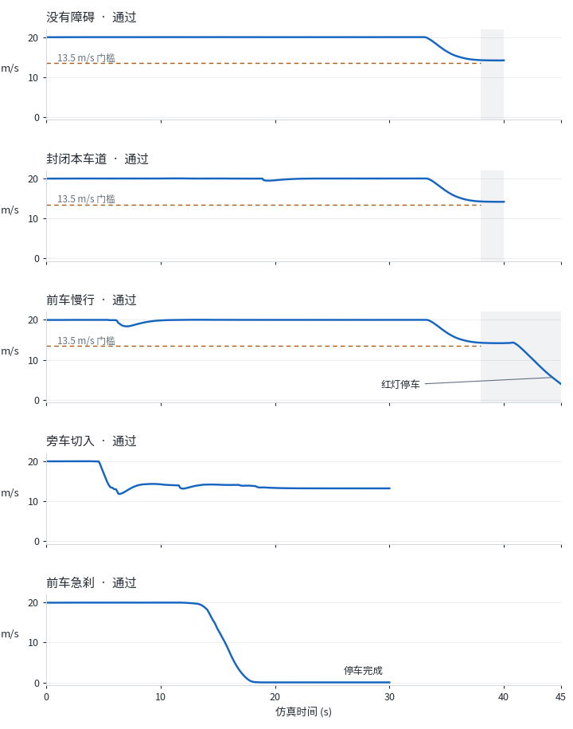
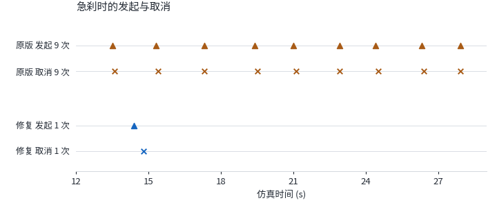
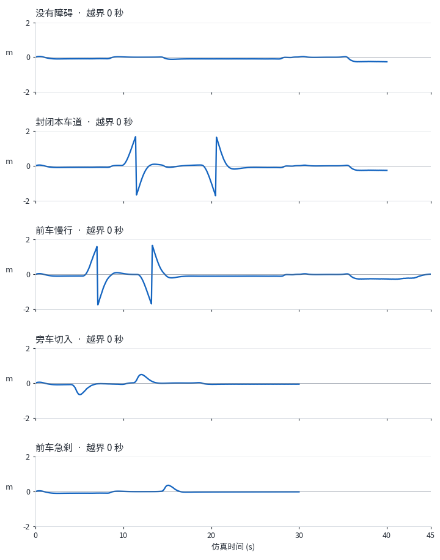

# 多拓扑 NMPC 修复与验收（2026-10-02）

最终 v6：**原五个 CARLA 场景 5/5，40 项新增单元测试 40/40；额外九场景离线回归 8/9**。离线 `blocked_left` 仍未满足从左侧超车的要求，不能声称全面通过。修改、仿真、数据处理与绘图均在 Ubuntu 完成，客户端仅通过 SSH 操作。原始版本署名 Claude Opus 5.5，本次修复与文档由 Codex 协助完成；保留 [README 上游致谢](../README.md#致谢)。

## 问题与修复

原训练已成功完成 **3 轮、287,029 个样本，退出码 0**。原 CARLA 验收 4/5：急刹场景共 9 次发起、9 次取消，原测试定义的任意 2 秒窗口最多 4 次决策事件，超过最多 2 次的门槛。训练成功不等于闭环决策稳定。

修复保留原预测模型、AL-iLQR 求解器、已训练价值网络和原验收脚本及门槛，改动集中在 [controller.py](../carsim_carla_bridge/controllers/topo_nmpc/controller.py) 与 [nmpc_decision.py](../carsim_carla_bridge/controllers/topo_nmpc/nmpc_decision.py)：

- 先检查当前数值有效性与近时域可行性，再比较代价。输入投影到可执行范围后重新预测并检查约束；仅允许复用在当前状态、道路和障碍物条件下重新验证过的同拓扑热启动。
- 正在换道的目标仍可行时保持目标；目标不可行时立即取消，有安全本车道方案则返回，否则在本车道内紧急制动。全部候选不可行时首帧即制动。
- 普通换道要求同一候选连续保持优势至少 0.25 秒。取消后至少等待 2.2 秒，并检查实测航向、横向运动和车道内位置恢复；完成换道后原 2 秒间隔保留。停车时允许车身完整处于车道边距内的稳定偏心位置恢复。
- 当前车道无可行方案时，满足恢复与冷却条件后可立即选择本帧可行邻道，避免等待确认而失去出口；不能绕过恢复、冷却或从危险的正在执行目标直接反向换道。
- 原椭圆碰撞约束外，车辆增加考虑自车航向的保守矩形分离包络，目标间距 1.2 m（包含跟踪和离散化余量）；静态物体保留原碰撞保护。这是预测约束参数，不是实际运行最小间距保证。

最终部署与验收快照一致：控制器 SHA-256 `511cfeb5b0938096b2f1b44a1f747e68c212d06d0e9407f957b502ce098c4be0`，选择器 `b34f5a3a6d7fd77b20c7675b1d97524c9e51f4c8b52f80bf74da0f8c313485b9`。修复前后保存的 `value_net.npz` 哈希相同：`02d78e66d619fa3997fb5540ea5b3c87e75957ec33c98babfd603e9aa48cd57c`。

## 原五场景 CARLA 验收

环境：Ubuntu 22.04.5 LTS，Intel Xeon E5-2682 v4，原版 CARLA 0.9.16、Town04_Opt 高速起点（出生点 41），PyChrono BMW E90 外部动力学，目标速度 72 km/h。仿真/控制周期 0.05 秒，CSV 采样 0.1 秒；最终五场景使用独立 CARLA 实例。

| 场景 | 时长 | 结果 | 最小包围盒间距 | 发起 / 取消 | 2 秒事件峰值 | 前 38 秒最低速度 | 平均求解耗时 |
|---|---:|---|---:|---:|---:|---:|---:|
| 没有障碍 | 40 s | PASS | 不适用 | 0 / 0 | 0 | 14.236 m/s | 172.1 ms |
| 封闭本车道 | 40 s | PASS | 0.63 m | 2 / 0 | 1 | 14.251 m/s | 167.7 ms |
| 前车慢行 | 45 s | PASS | 1.52 m | 2 / 0 | 1 | 14.268 m/s | 179.8 ms |
| 旁车切入 | 30 s | PASS | 18.02 m | 2 / 2 | 2 | 11.814 m/s | 192.2 ms |
| 前车急刹 | 30 s | PASS | 5.05 m | 1 / 1 | 2 | 0.018 m/s | 182.1 ms |

五场景均正常结束、退出码 0，碰撞次数与驶出行驶车道累计时间均为 0，原检查全部通过。发起不等于完成：急刹 1 次发起随后取消，最终完成换道 0 次；切入通过也不代表完成超车。封闭段末端为 390 m，源码实际距离断言为超过末端 20 m，即 **>410 m**，本次行驶 770.070 m。



速度为 `log.csv` 的 `Vx / 3.6`（km/h 转 m/s），横轴是仿真时间。**13.5 m/s 门槛仅检查没有障碍、封闭本车道、前车慢行的 t≤38 秒**，不适用于急刹和切入；无障碍另查约 3–25 秒直道段保持 19–21 m/s。38 秒后只是速度验收窗口之外，不是全段红灯期。慢车场景在 40.8 秒记录到红灯停车决策，45 秒末速 3.926 m/s，仍在减速，不能写成已完全停住。



急刹决策事件 **18→2**，分别为 **9 发起+9 取消→1 发起+1 取消**，两版完成换道均为 0；2 秒峰值 **4→2**。采样前轮转角指令绝对峰值 **6.004°→2.587°**，但偏移峰值 **0.143→0.362 m**、最小间距 **6.22→5.05 m**，不能声称每项指标都改善。

事件取单次运行 `output.txt`，打印时间精度 0.1 秒；稀疏 CSV 会漏掉短暂目标跳变，旧版仅记录到 10 次，不能代替完整事件计数。`u2` 是前轮转角指令（rad 转 deg），不是方向盘或实测轮胎转角。修复前后地图、出生点、场景、时长、同步、车辆辨识配置与单位一致，但旧记录没有全部控制器输入快照；这不是逐输入完全相同的回放或统计重复实验。



`offset` 单位为米，相对**当前车道中心**，左侧为正；跨车道时参考中心改变，可能跳变。这不是绝对横向轨迹，不能将跳变直接解释成车辆瞬移或抖动，也不能仅靠固定偏移线判断整个车身是否越界。

## 新增测试与额外离线回归

新增 [决策测试](../carsim_carla_bridge/tests/test_nmpc_decision.py) 25 项、[执行测试](../carsim_carla_bridge/tests/test_nmpc_execution.py) 6 项、[恢复测试](../carsim_carla_bridge/tests/test_nmpc_recovery.py) 5 项、[几何测试](../carsim_carla_bridge/tests/test_nmpc_clearance.py) 4 项，合计 **40/40**。覆盖有限值、当前可行性、投影与热启动重验、冷却恢复、最坏连续取消事件窗口，以及真实优化约束的车辆间距与静态原保护。

原离线脚本是另一集合：**8/9 场景、42/43 原断言**（40 项场景断言与 3 项单位/模型检查），退出码 1。使用不同轮胎、低 10% 附着、50 ms 转向延迟及二阶转向响应的独立被控模型，不能替代 CARLA 验收。

| 离线场景 | 最终结果 | 最小离线分离量 |
|---|---|---:|
| `curves` / `s_bends_100` | PASS / PASS | 不适用 |
| `overtake` | PASS | 1.621 m |
| `closure` | PASS | 0.921 m |
| `blocked_left` | **FAIL：右侧超车** | 1.625 m |
| `lead_brake` | PASS | 7.273 m |
| `red_light` | PASS | 不适用 |
| `cut_in` | PASS | 1.328 m |
| `pedestrian` | PASS | 5.558 m |

所有原碰撞、附着及间距门槛通过。`blocked_left` 原版留在车道 0，末速 12.225 m/s；最终版在 16.2 秒首次换道，访问 `[-1, 0]`（-1 为右侧），末速 19.762 m/s。速度恢复但仍违反左超要求，失败行为发生了变化。离线分离量是道路坐标对齐矩形的分离判定，与 CARLA 包围盒最短距离不同，不能混合比较。

## 复现入口

先按 [README](../README.md#快速开始) 配好后端、CARLA 与 PyChrono。以下从仓库根目录开始；`venv` 指已有后端环境。单测命令已在 Ubuntu 复跑确认，文档更新本身不重新训练或仿真。

```bash
cd carsim_carla_bridge
export PYTHONDONTWRITEBYTECODE=1 OMP_NUM_THREADS=1 OPENBLAS_NUM_THREADS=1 MKL_NUM_THREADS=1
../venv/bin/python -m unittest discover -s tests -p 'test_nmpc_*.py' -v
../venv/bin/python tests/test_offline_topo_nmpc.py -j 2
cd ..
```

离线脚本因已知 `blocked_left` 失败返回 1，应保留该结果。原五场景可通过现有脚本在专用 CARLA 上依次复验：

```bash
bash scripts/carla_pool.sh start 2100
cd carsim_carla_bridge
export PYTHONDONTWRITEBYTECODE=1 OMP_NUM_THREADS=1 OPENBLAS_NUM_THREADS=1 MKL_NUM_THREADS=1
../venv/bin/python tests/test_topo_nmpc_carla.py --port 2100 --backend-port 57147 --keep ../validation-runs/nmpc
cd ..
bash scripts/carla_pool.sh stop 2100
```

测试启动自己的后端，自动查找常见位置的 `chrono` 环境；其他位置用现有 `--chrono-python` 参数指定。只测急刹可加 `--only 前车急刹`；并行运行需独立 CARLA/后端端口与记录目录。`--keep` 保存运行 JSON、CSV 和输出。这些命令不会自动获得未随仓库发布的本次原始验收日志。

## 限制

- 结论只覆盖本次固定场景与配置，不代表所有交通、路况、车辆或实车安全验证；路口横穿交通等原有限制仍在。
- 可行性按原 `VIOL_TOL=0.05` 容差和近处 2.5 秒判定，更远约束使用罚项；预测与离散采样有误差，不能当作连续时间安全保证。
- 平均求解 167.7–192.2 ms 满足原 <250 ms 门槛，但超过 50 ms 仿真步长，同步运行慢于实时。
- 图中峰值仅覆盖 CSV 采样；间距取控制帧累计统计、显示两位小数，无障碍时为不适用。离线 runner 未保留完整逐帧轨迹，独立审核复算 30 项精确数值断言并校验源文件，没有声称重审未保存的轨迹。
